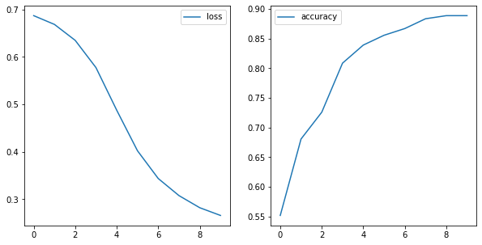
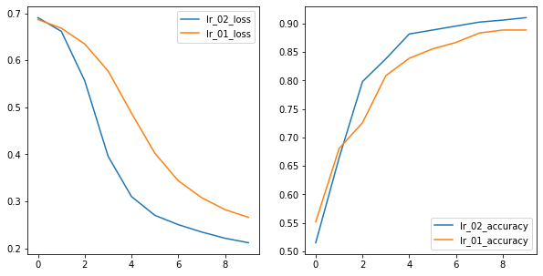
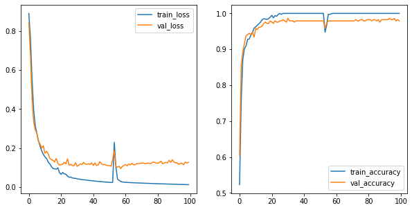
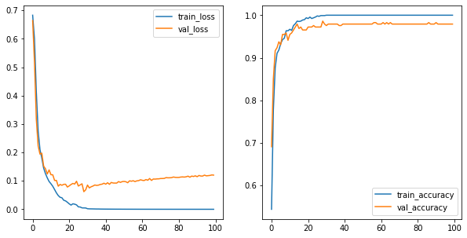
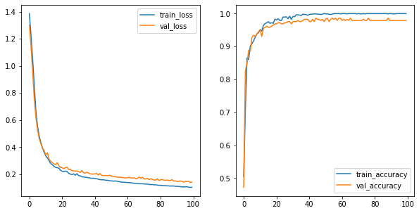
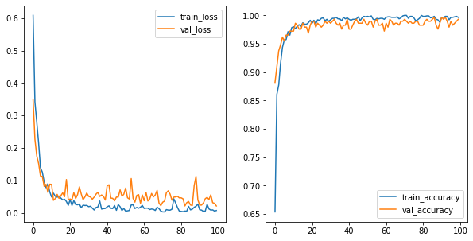
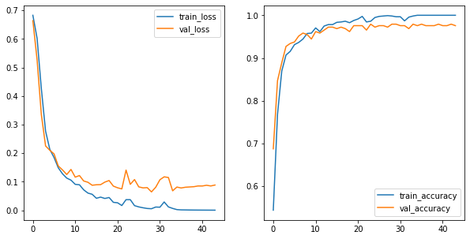
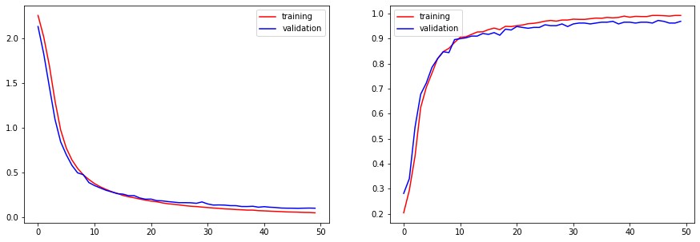

# Tensorflow and Keras

## Modeling

Let's review some modeling concepts we've used to date with [this quick exercise](https://forms.gle/yrPxUp2Xj4R9FeyEA)


We do this to remind ourselves that the basic components of good modeling practice, and even the methods themselves, are _the same_ with Neural Nets as that are with _sklearn_ or _statsmodels_.

The above exercise uses only one train-test split, but is still useful.  We will be using train, validation, test in this notebook, for good practice.

## Objectives:
- Compare pros and cons of Keras vs TensorFlow
- hands on practice coding a neural network


```python
import keras
```

    Using TensorFlow backend.


Wait a second, what is that warning? 
`Using TensorFlow backend.`

<br>
### Keras is an API

Coded in Python, that can be layered on top of many different back-end processing systems.


While each of these systems has their own coding methods, Keras abstracts from that in streamlined pythonic manner we are used to seeing in other python modeling libraries.

Keras development is backed primarily by Google, and the Keras API comes packaged in TensorFlow as tf.keras. Additionally, Microsoft maintains the CNTK Keras backend. Amazon AWS is maintaining the Keras fork with MXNet support. Other contributing companies include NVIDIA, Uber, and Apple (with CoreML).

Theano has been discontinued.  The last release was 2017, but can still be used.

We will use TensorFlow, as it is the most popular. TensorFlow became the most used Keras backend, and  eventually integrated Keras into via the tf.keras submodule of TensorFlow.  

## Wait, what's TensorFlow?


## Let's start with tensors

## Tensors are multidimensional matricies


### TensorFlow manages the flow of matrix math

That makes neural network processing possible.


For our numbers dataset, our tensors from the sklearn dataset were originally tensors of the shape 8x8, i.e.64 pictures.  Remember, that was with black and white images.

For image processing, we are often dealing with color.


```python
from sklearn.datasets import load_sample_images
image = load_sample_images()['images'][0]
```


```python
import matplotlib.pyplot as plt
import matplotlib.image as mpimg

imgplot = plt.imshow(image)
```


```python
image.shape
```


    (427, 640, 3)


What do the dimensions of our image above represent?


```python
import numpy as np
from matplotlib import pyplot as plt

mccalister = ['Adam', 'Amanda','Chum', 'Dann',
 'Jacob', 'Jason', 'Johnhoy', 'Karim',
'Leana','Luluva', 'Matt', 'Maximilian','Syd' ]

# This is always a good idea
%load_ext autoreload
%autoreload 2

import os
import sys
module_path = os.path.abspath(os.path.join(os.pardir, os.pardir))
if module_path not in sys.path:
    sys.path.append(module_path)
    
from src.student_caller import one_random_student

import warnings
warnings.filterwarnings('ignore')
```


```python
one_random_student(mccalister)
```

    Matt


Tensors with higher numbers of dimensions have a higher **rank**, in the language of TensorFlow.

A matrix with rows and columns only, like the black and white numbers, are **rank 2**.

A matrix with a third dimension, like the color pictures above, are **rank 3**.

When we flatten an image by stacking the rows in a column, we are decreasing the rank. 


```python
flat_image = image.reshape(-1,1)
```

When we unrow a column, we increase its rank.


```python
unrowed = flat_image.reshape(427,640, -1)
```


```python
imgplot = plt.imshow(unrowed)
```


### Wait, what tool am I even using, what's Keras?
## More levers and buttons

Coding directly in **Tensorflow** allows you to tweak more parameters to optimize performance. The **Keras** wrapper makes the code more accessible for developers prototyping models.


### Keras, an API with an intentional UX

- Deliberately design end-to-end user workflows
- Reduce cognitive load for your users
- Provide helpful feedback to your users

[full article here](https://blog.keras.io/user-experience-design-for-apis.html)<br>
[full list of why to use Keras](https://keras.io/why-use-keras/)

### A few comparisons

While you **can leverage both**, here are a few comparisons.

| Comparison | Keras | Tensorflow|
|------------|-------|-----------|
| **Level of API** | high-level API | High and low-level APIs |
| **Speed** |  can *seem* slower |  is a bit faster |
| **Language architecture** | simple architecture, more readable and concise | straight tensorflow is a bit more complex |
| **Debugging** | less frequent need to debug | difficult to debug |
| **Datasets** | usually used for small datasets | high performance models and large datasets that require fast execution|

This is also a _**non-issue**_ - as you can leverage tensorflow commands within keras and vice versa. If Keras ever seems slower, it's because the developer's time is more expensive than the GPUs. Keras is designed with the developer in mind. 


[reference link](https://www.edureka.co/blog/keras-vs-tensorflow-vs-pytorch/)

### Pair Challenge:

</br>

Let's use a Keras neural net on the UCI digit dataset we imported from sklearn yesterday.

Let's continue where we left off with our numbers dataset.


```python
from sklearn.datasets import load_digits
from sklearn.model_selection import train_test_split
digits = load_digits()
X = digits.data
y = digits.target

```

We will start with a binary classification, and predict whether the number will be even or odd.


```python
y_binary = y % 2
y_binary
```


    array([0, 1, 0, ..., 0, 1, 0])


In pairs, proceed through the following three parts. 

#### Part 1:
Questions to answer:
- How many input variables are there in this dataset? 
- What does the range of values (0-16) represent in our feature set?
- What does a 1 mean in our target class?
- If we use a neural net to predict this, what loss function do we use?
***

***
#### Part 2:
What if you wanted to create a NN with hidden layers to predict even numbers with:
- 12 nodes in the first hidden layer
- 8 nodes in the second hidden layer
- relu on the first two activations
- sigmoid on the last one

Answer the following questions:
- How many nodes in the input layer?
- How many nodes in the output layer?
- Will the output layer produce an integer or a float?
***

***

#### Part 3:
Knowing that you want:
- batch size of 10
- 50 epochs
- to use `rmsprop` as your optimizer
- and all the numbers you defined above...

**Fill out the code below with the correct specifications, but don't run it yet**


```python
model = Sequential()
model.add(Dense(   , activation= , input_dim= ))
model.add(Dense( ,  activation= ))
model.add(Dense(  , activation =  ))

model.compile(optimizer= ,
              loss=,
              metrics=['accuracy'])
model.fit(data, labels, epochs=, batch_size=  )
```


      File "<ipython-input-12-990b674031ad>", line 2
        model.add(Dense(   , activation= , input_dim= ))
                           ^
    SyntaxError: invalid syntax


```python
#__SOLUTION__

model = Sequential()
model.add(Dense(12, activation='relu', input_dim=64,))
model.add(Dense(8 ,  activation='relu' ))
model.add(Dense(1 , activation = 'sigmoid' ))

model.compile(optimizer='rmsprop' ,
              loss='binary_crossentropy'  ,
              metrics=['accuracy'])
model.fit(X, y_binary, epochs=50, batch_size= 10 )
```


    ---------------------------------------------------------------------------

    NameError                                 Traceback (most recent call last)

    <ipython-input-14-a125b243e4fe> in <module>
          1 #__SOLUTION__
          2 
    ----> 3 model = Sequential()
          4 model.add(Dense(12, activation='relu', input_dim=64,))
          5 model.add(Dense(8 ,  activation='relu' ))


    NameError: name 'Sequential' is not defined


### Things to know:
- the data and labels in `fit()` need to be numpy arrays, not pandas dfs. Else it won't work.
- Scaling your data will have a large impact on your model.   
   > For our traditional input features, we would use a scalar object.  For images, as long as the minimum value is 0, we can simply divide through by the maximum pixel intensity.


We have come across several scenerios where scaling is important. In addition to improving the speed of gradient descent, what other scenarios did we stress scaling?


```python
one_random_student(mccalister)
```

    Amanda


#### Getting data ready for modeling
**Preprocessing**:

- use train_test_split to create X_train, y_train, X_test, and y_test
- Split training data into train and validation sets.
- Scale the pixel intensity to a value between 0 and 1.
- Scale the pixel intensity to a value between 0 and 1.


Scaling our input variables will help speed up our neural network [see 4.3](http://yann.lecun.com/exdb/publis/pdf/lecun-98b.pdf)

Since our minimum intensity is 0, we can normalize the inputs by dividing each value by the max value (16). 


```python

from sklearn.model_selection import train_test_split

X_train, X_test, y_train, y_test = train_test_split(X, y_binary, random_state=42, test_size=.2)
X_t, X_val, y_t, y_val = train_test_split(X_train, y_train, random_state=42, test_size=.2)
X_t, X_val, X_test = X_t/16, X_val/16, X_test/16

```

Now that our data is ready, let's load in the keras Sequential class.  

Sequential refers to a sequence of layers that feed directly into one another with exactly [one input tensor and one output tensor](https://www.tensorflow.org/guide/keras/sequential_model)


```python
from keras.models import Sequential
```

A dense layer receives input from every node from the previous layer.


```python
from keras.layers import Dense
```

Let's start working through the different choices we can make in our network.

For activation, let's start with the familiar sigmoid function, and see how it performs.


```python
np.random.seed(42)
model = Sequential()
# We will start with our trusty sigmoid function.
# What does input dimension correspond to?
model.add(Dense(12, activation='sigmoid', input_dim=64,))
model.add(Dense(8 ,  activation='sigmoid' ))
model.add(Dense(1 , activation = 'sigmoid' ))

model.compile(optimizer='SGD' ,
              # We use binary_crossentropy for a binary loss function
              loss='binary_crossentropy'  ,
              metrics=['accuracy'])

# Assign the variable history to store the results, and set verbose=1 so we can see the output.
results = model.fit(X_t, y_t, epochs=10, batch_size=100, verbose=1)
```

    Epoch 1/10
    1149/1149 [==============================] - 0s 121us/step - loss: 0.7928 - acc: 0.5039
    Epoch 2/10
    1149/1149 [==============================] - 0s 11us/step - loss: 0.7743 - acc: 0.5039
    Epoch 3/10
    1149/1149 [==============================] - 0s 11us/step - loss: 0.7593 - acc: 0.5039
    Epoch 4/10
    1149/1149 [==============================] - 0s 12us/step - loss: 0.7465 - acc: 0.5039
    Epoch 5/10
    1149/1149 [==============================] - 0s 12us/step - loss: 0.7360 - acc: 0.5039
    Epoch 6/10
    1149/1149 [==============================] - 0s 15us/step - loss: 0.7273 - acc: 0.5039
    Epoch 7/10
    1149/1149 [==============================] - 0s 12us/step - loss: 0.7200 - acc: 0.5039
    Epoch 8/10
    1149/1149 [==============================] - 0s 11us/step - loss: 0.7143 - acc: 0.5039
    Epoch 9/10
    1149/1149 [==============================] - 0s 16us/step - loss: 0.7094 - acc: 0.5039
    Epoch 10/10
    1149/1149 [==============================] - 0s 13us/step - loss: 0.7057 - acc: 0.5039


We can access the history of our model via `results.history`.
Use __dict__ to take a tour.


```python
results.__dict__
```


    {'validation_data': [],
     'model': <keras.engine.sequential.Sequential at 0x1a31f2b9b0>,
     'params': {'batch_size': 100,
      'epochs': 10,
      'steps': None,
      'samples': 1149,
      'verbose': 1,
      'do_validation': False,
      'metrics': ['loss', 'acc']},
     'epoch': [0, 1, 2, 3, 4, 5, 6, 7, 8, 9],
     'history': {'loss': [0.7928334127518278,
       0.7742922526011786,
       0.7593016322018065,
       0.7464719206172554,
       0.7359635693493669,
       0.7273100739567046,
       0.7200160783409969,
       0.7143256384668607,
       0.7094395855803195,
       0.7056822007484702],
      'acc': [0.5039164503311675,
       0.5039164402154968,
       0.5039164425498823,
       0.503916435183599,
       0.5039164403711225,
       0.5039164400339334,
       0.5039164467517763,
       0.5039164456364588,
       0.5039164412011262,
       0.5039164467517763]}}


```python
import seaborn as sns
import matplotlib.pyplot as plt
import numpy as np


sigmoid_loss = results.history['loss']
sigmoid_accuracy = results.history['acc']

fig, (ax1, ax2) = plt.subplots(1,2, figsize=(10,5))
sns.lineplot(results.epoch, results.history['loss'], ax=ax1, label='loss')
sns.lineplot(results.epoch, results.history['acc'], ax=ax2, label='accuracy')
```


    <matplotlib.axes._subplots.AxesSubplot at 0x1a327908d0>


We have two plots above both relating to the quality fo our model.  The left-hand plot is our loss. It uses the probabilities associated with our predictions to judge how well our prediction fits reality. We want it to decrease as far as possible.

The accuracy judges how well the predictions are after applying the threshold at the output layer.  We want accuracy to increase.

If we look at our loss, it is still decreasing. That is a signal that our model is **still learning**. If our model is still learning, we can allow it to get better by turning several dials. First, let's increase the number of epochs.


```python
# Review: what is an epoch?
one_random_student(mccalister)
```

    Johnhoy


```python
model = Sequential()
model.add(Dense(12, activation='sigmoid', input_dim=64,))
model.add(Dense(8 ,  activation='sigmoid' ))
model.add(Dense(1 , activation = 'sigmoid' ))

model.compile(optimizer='SGD' ,
              loss='binary_crossentropy'  ,
              metrics=['accuracy'])

# Assign the variable history to store the results, and set verbose=1 so we can see the output.
results = model.fit(X_t, y_t, epochs=50, batch_size=32, verbose=1)
```

    Epoch 1/50
    1149/1149 [==============================] - 0s 210us/step - loss: 0.7099 - acc: 0.5039
    Epoch 2/50
    1149/1149 [==============================] - 0s 32us/step - loss: 0.6980 - acc: 0.5039
    Epoch 3/50
    1149/1149 [==============================] - 0s 34us/step - loss: 0.6919 - acc: 0.5039
    Epoch 4/50
    1149/1149 [==============================] - 0s 35us/step - loss: 0.6889 - acc: 0.5039
    Epoch 5/50
    1149/1149 [==============================] - 0s 37us/step - loss: 0.6873 - acc: 0.5039
    Epoch 6/50
    1149/1149 [==============================] - 0s 42us/step - loss: 0.6863 - acc: 0.5065
    Epoch 7/50
    1149/1149 [==============================] - 0s 34us/step - loss: 0.6857 - acc: 0.5344
    Epoch 8/50
    1149/1149 [==============================] - 0s 39us/step - loss: 0.6853 - acc: 0.5953
    Epoch 9/50
    1149/1149 [==============================] - 0s 38us/step - loss: 0.6850 - acc: 0.6562
    Epoch 10/50
    1149/1149 [==============================] - 0s 35us/step - loss: 0.6847 - acc: 0.6458
    Epoch 11/50
    1149/1149 [==============================] - 0s 32us/step - loss: 0.6842 - acc: 0.6884
    Epoch 12/50
    1149/1149 [==============================] - 0s 35us/step - loss: 0.6841 - acc: 0.6745
    Epoch 13/50
    1149/1149 [==============================] - 0s 33us/step - loss: 0.6837 - acc: 0.7006
    Epoch 14/50
    1149/1149 [==============================] - 0s 36us/step - loss: 0.6834 - acc: 0.6867
    Epoch 15/50
    1149/1149 [==============================] - 0s 35us/step - loss: 0.6830 - acc: 0.7276
    Epoch 16/50
    1149/1149 [==============================] - 0s 34us/step - loss: 0.6827 - acc: 0.7293
    Epoch 17/50
    1149/1149 [==============================] - 0s 34us/step - loss: 0.6824 - acc: 0.7163
    Epoch 18/50
    1149/1149 [==============================] - 0s 35us/step - loss: 0.6821 - acc: 0.7171
    Epoch 19/50
    1149/1149 [==============================] - 0s 35us/step - loss: 0.6818 - acc: 0.7163
    Epoch 20/50
    1149/1149 [==============================] - 0s 33us/step - loss: 0.6814 - acc: 0.7311
    Epoch 21/50
    1149/1149 [==============================] - 0s 33us/step - loss: 0.6811 - acc: 0.7276
    Epoch 22/50
    1149/1149 [==============================] - 0s 34us/step - loss: 0.6807 - acc: 0.7285
    Epoch 23/50
    1149/1149 [==============================] - 0s 35us/step - loss: 0.6803 - acc: 0.7398
    Epoch 24/50
    1149/1149 [==============================] - 0s 36us/step - loss: 0.6800 - acc: 0.7433
    Epoch 25/50
    1149/1149 [==============================] - 0s 37us/step - loss: 0.6796 - acc: 0.7528
    Epoch 26/50
    1149/1149 [==============================] - 0s 34us/step - loss: 0.6792 - acc: 0.7441
    Epoch 27/50
    1149/1149 [==============================] - 0s 32us/step - loss: 0.6788 - acc: 0.7476
    Epoch 28/50
    1149/1149 [==============================] - 0s 33us/step - loss: 0.6784 - acc: 0.7598
    Epoch 29/50
    1149/1149 [==============================] - 0s 38us/step - loss: 0.6781 - acc: 0.7546
    Epoch 30/50
    1149/1149 [==============================] - 0s 34us/step - loss: 0.6776 - acc: 0.7668
    Epoch 31/50
    1149/1149 [==============================] - 0s 35us/step - loss: 0.6772 - acc: 0.7572
    Epoch 32/50
    1149/1149 [==============================] - 0s 34us/step - loss: 0.6767 - acc: 0.7633
    Epoch 33/50
    1149/1149 [==============================] - 0s 36us/step - loss: 0.6763 - acc: 0.7685
    Epoch 34/50
    1149/1149 [==============================] - 0s 35us/step - loss: 0.6759 - acc: 0.7546
    Epoch 35/50
    1149/1149 [==============================] - 0s 37us/step - loss: 0.6754 - acc: 0.7624
    Epoch 36/50
    1149/1149 [==============================] - 0s 34us/step - loss: 0.6750 - acc: 0.7633
    Epoch 37/50
    1149/1149 [==============================] - 0s 34us/step - loss: 0.6745 - acc: 0.7633
    Epoch 38/50
    1149/1149 [==============================] - 0s 30us/step - loss: 0.6740 - acc: 0.7711
    Epoch 39/50
    1149/1149 [==============================] - 0s 43us/step - loss: 0.6735 - acc: 0.7694
    Epoch 40/50
    1149/1149 [==============================] - 0s 34us/step - loss: 0.6731 - acc: 0.7737
    Epoch 41/50
    1149/1149 [==============================] - 0s 43us/step - loss: 0.6725 - acc: 0.7633
    Epoch 42/50
    1149/1149 [==============================] - 0s 37us/step - loss: 0.6720 - acc: 0.7815
    Epoch 43/50
    1149/1149 [==============================] - 0s 31us/step - loss: 0.6715 - acc: 0.7737
    Epoch 44/50
    1149/1149 [==============================] - 0s 31us/step - loss: 0.6709 - acc: 0.7702
    Epoch 45/50
    1149/1149 [==============================] - 0s 29us/step - loss: 0.6703 - acc: 0.7763
    Epoch 46/50
    1149/1149 [==============================] - 0s 33us/step - loss: 0.6697 - acc: 0.7728
    Epoch 47/50
    1149/1149 [==============================] - 0s 32us/step - loss: 0.6691 - acc: 0.7833
    Epoch 48/50
    1149/1149 [==============================] - 0s 31us/step - loss: 0.6685 - acc: 0.7842
    Epoch 49/50
    1149/1149 [==============================] - 0s 36us/step - loss: 0.6679 - acc: 0.7737
    Epoch 50/50
    1149/1149 [==============================] - 0s 33us/step - loss: 0.6673 - acc: 0.7815


```python
sigmoid_loss = results.history['loss']
sigmoid_accuracy = results.history['acc']

fig, (ax1, ax2) = plt.subplots(1,2, figsize=(10,5))
sns.lineplot(results.epoch, sigmoid_loss, ax=ax1, label='loss')
sns.lineplot(results.epoch, sigmoid_accuracy, ax=ax2, label='accuracy')
```


    <matplotlib.axes._subplots.AxesSubplot at 0x1a3536e470>


It still looks like our model has not **converged**. Convergence is when our model has plateaued after adjusting the parameters to their optimal values. 

The loss is still decreasing, and the accuracy is still increasing.  We could continue increasing the epochs, but that will be time consuming.  

We could try decreasing the batch size. Let's set the batch size to 1.  This is true stochastic gradient descent.  The parameters are updated after each sample is passed into the model.

SGD with a small batch size takes longer to run through an epoch, but will take less epochs to improve.


```python
model = Sequential()
model.add(Dense(12, activation='sigmoid', input_dim=64,))
model.add(Dense(8 ,  activation='sigmoid' ))
model.add(Dense(1 , activation = 'sigmoid' ))

model.compile(optimizer='SGD' ,
              loss='binary_crossentropy'  ,
              metrics=['accuracy'])

# Assign the variable history to store the results, and set verbose=1 so we can see the output.
results = model.fit(X_t, y_t, epochs=10, batch_size=1, verbose=1)
```

    Epoch 1/10
    1149/1149 [==============================] - 1s 872us/step - loss: 0.6870 - acc: 0.5518
    Epoch 2/10
    1149/1149 [==============================] - 1s 762us/step - loss: 0.6685 - acc: 0.6806
    Epoch 3/10
    1149/1149 [==============================] - 1s 771us/step - loss: 0.6349 - acc: 0.7258
    Epoch 4/10
    1149/1149 [==============================] - 1s 744us/step - loss: 0.5775 - acc: 0.8085
    Epoch 5/10
    1149/1149 [==============================] - 1s 736us/step - loss: 0.4877 - acc: 0.8390
    Epoch 6/10
    1149/1149 [==============================] - 1s 750us/step - loss: 0.4023 - acc: 0.8555
    Epoch 7/10
    1149/1149 [==============================] - 1s 734us/step - loss: 0.3438 - acc: 0.8668
    Epoch 8/10
    1149/1149 [==============================] - 1s 775us/step - loss: 0.3078 - acc: 0.8834
    Epoch 9/10
    1149/1149 [==============================] - 1s 745us/step - loss: 0.2823 - acc: 0.8886
    Epoch 10/10
    1149/1149 [==============================] - 1s 759us/step - loss: 0.2660 - acc: 0.8886


```python
sigmoid_one_loss = results.history['loss']
sigmoid_one_accuracy = results.history['acc']

fig, (ax1, ax2) = plt.subplots(1,2, figsize=(10,5))
sns.lineplot(results.epoch, sigmoid_one_loss, ax=ax1, label='loss')
sns.lineplot(results.epoch, sigmoid_one_accuracy, ax=ax2, label='accuracy')
```


    <matplotlib.axes._subplots.AxesSubplot at 0x1a33370748>





Comparing our 50 epoch version with a 500 batch size and a 10 epoch version with a 1 example batch size, we see that by 10 epochs, the latter has achieved 90% accuracy by the final epoch, while our 23 batch size is just about 70%.  However, with the 1 example batch, each epoch took a lot longer.

Still, even though the 2nd model reached a higher accuracy and lower loss, it looks like it still has not stopped learning. The slope of the loss is getting smaller, but it has not leveled out completely.

From yesterday's lesson, you may remember that the vanilla SGD optimizer applies a constant learning rate accross all values.  Let's look at the default value.  

If we increase the learning rate, our parameter adjustments will take bigger steps, allowing us to proceed more quickly down the gradient.


```python
from keras.optimizers import SGD

model = Sequential()

sgd = SGD(lr=.02)
model.add(Dense(12, activation='sigmoid', input_dim=64,))
model.add(Dense(8 ,  activation='sigmoid' ))
model.add(Dense(1 , activation = 'sigmoid' ))

model.compile(optimizer=sgd ,
              loss='binary_crossentropy'  ,
              metrics=['accuracy'])

# Assign the variable history to store the results, and set verbose=1 so we can see the output.
results = model.fit(X_t, y_t, epochs=10, batch_size=1, verbose=1)
```

    Epoch 1/10
    1149/1149 [==============================] - 1s 931us/step - loss: 0.6910 - acc: 0.5152
    Epoch 2/10
    1149/1149 [==============================] - 1s 766us/step - loss: 0.6618 - acc: 0.6641
    Epoch 3/10
    1149/1149 [==============================] - 1s 792us/step - loss: 0.5567 - acc: 0.7981
    Epoch 4/10
    1149/1149 [==============================] - 1s 769us/step - loss: 0.3958 - acc: 0.8381
    Epoch 5/10
    1149/1149 [==============================] - 1s 738us/step - loss: 0.3101 - acc: 0.8816
    Epoch 6/10
    1149/1149 [==============================] - 1s 792us/step - loss: 0.2702 - acc: 0.8886
    Epoch 7/10
    1149/1149 [==============================] - 1s 735us/step - loss: 0.2504 - acc: 0.8956
    Epoch 8/10
    1149/1149 [==============================] - 1s 751us/step - loss: 0.2347 - acc: 0.9025
    Epoch 9/10
    1149/1149 [==============================] - 1s 757us/step - loss: 0.2214 - acc: 0.9060
    Epoch 10/10
    1149/1149 [==============================] - 1s 763us/step - loss: 0.2119 - acc: 0.9104


```python
lr_02_loss = results.history['loss']
lr_02_accuracy = results.history['acc']

fig, (ax1, ax2) = plt.subplots(1,2, figsize=(10,5))
sns.lineplot(results.epoch, lr_02_loss, ax=ax1, label='lr_02_loss')
sns.lineplot(results.epoch, lr_02_accuracy, ax=ax2, label='lr_02_accuracy')

sns.lineplot(results.epoch,sigmoid_one_loss, ax=ax1, label='lr_01_loss')
sns.lineplot(results.epoch, sigmoid_one_accuracy, ax=ax2, label='lr_01_accuracy')


```


    <matplotlib.axes._subplots.AxesSubplot at 0x1a33f15c18>





If we increase the learning rate to a very high number, we see that our model overshoots the minimum, and starts bouncing all around.


```python
from keras.optimizers import SGD

model = Sequential()

sgd = SGD(lr=9)
model.add(Dense(12, activation='sigmoid', input_dim=64,))
model.add(Dense(8 ,  activation='sigmoid' ))
model.add(Dense(1 , activation = 'sigmoid' ))

model.compile(optimizer=sgd ,
              loss='binary_crossentropy'  ,
              metrics=['accuracy'])

# Assign the variable history to store the results, and set verbose=1 so we can see the output.
results = model.fit(X_t, y_t, epochs=30, batch_size=10, verbose=1)

relu_loss = results.history['loss']
relu_accuracy = results.history['acc']

fig, (ax1, ax2) = plt.subplots(1,2, figsize=(10,5))
sns.lineplot(results.epoch, relu_loss, ax=ax1, label='loss')
sns.lineplot(results.epoch, relu_accuracy, ax=ax2, label='accuracy')
```

    Epoch 1/30
    1149/1149 [==============================] - 0s 344us/step - loss: 0.9546 - acc: 0.5283
    Epoch 2/30
    1149/1149 [==============================] - 0s 86us/step - loss: 0.9878 - acc: 0.4909
    Epoch 3/30
    1149/1149 [==============================] - 0s 98us/step - loss: 0.9413 - acc: 0.5257
    Epoch 4/30
    1149/1149 [==============================] - 0s 99us/step - loss: 1.1088 - acc: 0.4865
    Epoch 5/30
    1149/1149 [==============================] - 0s 92us/step - loss: 1.0151 - acc: 0.4970
    Epoch 6/30
    1149/1149 [==============================] - 0s 87us/step - loss: 1.0805 - acc: 0.4795
    Epoch 7/30
    1149/1149 [==============================] - 0s 83us/step - loss: 1.1492 - acc: 0.4865
    Epoch 8/30
    1149/1149 [==============================] - 0s 99us/step - loss: 1.0375 - acc: 0.4909
    Epoch 9/30
    1149/1149 [==============================] - 0s 98us/step - loss: 1.0884 - acc: 0.4891
    Epoch 10/30
    1149/1149 [==============================] - 0s 92us/step - loss: 1.1105 - acc: 0.4874
    Epoch 11/30
    1149/1149 [==============================] - 0s 92us/step - loss: 0.9936 - acc: 0.5048
    Epoch 12/30
    1149/1149 [==============================] - 0s 101us/step - loss: 0.9538 - acc: 0.5091
    Epoch 13/30
    1149/1149 [==============================] - 0s 94us/step - loss: 1.1038 - acc: 0.4743
    Epoch 14/30
    1149/1149 [==============================] - 0s 94us/step - loss: 1.0204 - acc: 0.4978
    Epoch 15/30
    1149/1149 [==============================] - 0s 105us/step - loss: 0.9248 - acc: 0.5161
    Epoch 16/30
    1149/1149 [==============================] - 0s 121us/step - loss: 1.0313 - acc: 0.4970
    Epoch 17/30
    1149/1149 [==============================] - 0s 100us/step - loss: 1.0695 - acc: 0.4778
    Epoch 18/30
    1149/1149 [==============================] - 0s 97us/step - loss: 1.0230 - acc: 0.4917
    Epoch 19/30
    1149/1149 [==============================] - 0s 100us/step - loss: 1.1192 - acc: 0.4856
    Epoch 20/30
    1149/1149 [==============================] - 0s 91us/step - loss: 0.9462 - acc: 0.5013
    Epoch 21/30
    1149/1149 [==============================] - 0s 125us/step - loss: 0.9969 - acc: 0.5083
    Epoch 22/30
    1149/1149 [==============================] - 0s 100us/step - loss: 0.9611 - acc: 0.5074
    Epoch 23/30
    1149/1149 [==============================] - 0s 103us/step - loss: 1.0848 - acc: 0.4804
    Epoch 24/30
    1149/1149 [==============================] - 0s 98us/step - loss: 0.9954 - acc: 0.5022
    Epoch 25/30
    1149/1149 [==============================] - 0s 99us/step - loss: 0.9754 - acc: 0.5013
    Epoch 26/30
    1149/1149 [==============================] - 0s 96us/step - loss: 0.9596 - acc: 0.5109
    Epoch 27/30
    1149/1149 [==============================] - 0s 86us/step - loss: 0.9614 - acc: 0.5144
    Epoch 28/30
    1149/1149 [==============================] - 0s 89us/step - loss: 1.0154 - acc: 0.5074
    Epoch 29/30
    1149/1149 [==============================] - 0s 89us/step - loss: 0.9779 - acc: 0.4917
    Epoch 30/30
    1149/1149 [==============================] - 0s 112us/step - loss: 0.9510 - acc: 0.4996


    <matplotlib.axes._subplots.AxesSubplot at 0x1a3447df98>


Let's get a bit more modern, and apply a relu activation function in our layers.


```python
model = Sequential()
model.add(Dense(12, activation='relu', input_dim=64,))
model.add(Dense(8 ,  activation='relu' ))
model.add(Dense(1 , activation = 'sigmoid' ))

model.compile(optimizer='SGD',
              loss='binary_crossentropy',
              metrics=['accuracy'])

# We can tinker with verbose to show the output
results = model.fit(X_t, y_t, epochs=50, batch_size= 32, verbose=0)
```


```python
relu_loss = results.history['loss']
relu_accuracy = results.history['acc']

fig, (ax1, ax2) = plt.subplots(1,2, figsize=(10,5))
sns.lineplot(results.epoch, relu_loss, ax=ax1, label='loss')
sns.lineplot(results.epoch, relu_accuracy, ax=ax2, label='accuracy')
```


    <matplotlib.axes._subplots.AxesSubplot at 0x1a34e9fdd8>


Compared to our original sigmoid with 50 epochs and batch 32, the relu activation reaches a much higher accuracy

Let's try batch size 1


```python
model = Sequential()
model.add(Dense(12, activation='relu', input_dim=64,))
model.add(Dense(8 ,  activation='relu' ))
model.add(Dense(1 , activation = 'sigmoid' ))

model.compile(optimizer='SGD',
              loss='binary_crossentropy',
              metrics=['accuracy'])

# We can tinker with verbose to show the output
results = model.fit(X_t, y_t, epochs=10, batch_size= 1, verbose=1)
```

    Epoch 1/10
    1149/1149 [==============================] - 1s 994us/step - loss: 0.4985 - acc: 0.7772
    Epoch 2/10
    1149/1149 [==============================] - 1s 809us/step - loss: 0.3385 - acc: 0.8808
    Epoch 3/10
    1149/1149 [==============================] - 1s 797us/step - loss: 0.2547 - acc: 0.9138 0s - loss: 0.2830
    Epoch 4/10
    1149/1149 [==============================] - 1s 781us/step - loss: 0.2057 - acc: 0.9304
    Epoch 5/10
    1149/1149 [==============================] - 1s 798us/step - loss: 0.1799 - acc: 0.9321
    Epoch 6/10
    1149/1149 [==============================] - 1s 775us/step - loss: 0.1458 - acc: 0.9504
    Epoch 7/10
    1149/1149 [==============================] - 1s 839us/step - loss: 0.1347 - acc: 0.9521
    Epoch 8/10
    1149/1149 [==============================] - 1s 770us/step - loss: 0.1170 - acc: 0.9565
    Epoch 9/10
    1149/1149 [==============================] - 1s 783us/step - loss: 0.1061 - acc: 0.9661
    Epoch 10/10
    1149/1149 [==============================] - 1s 826us/step - loss: 0.1021 - acc: 0.9634: 0s - loss: 0.1051


```python
relu_loss = results.history['loss']
relu_accuracy = results.history['acc']

fig, (ax1, ax2) = plt.subplots(1,2, figsize=(10,5))
sns.lineplot(results.epoch, relu_loss, ax=ax1, label='loss')
sns.lineplot(results.epoch, relu_accuracy, ax=ax2, label='accuracy')
```


    <matplotlib.axes._subplots.AxesSubplot at 0x1a3584fcc0>


We are reaching a high accuracy, but still looks like our model has not converged. If we increased our number of epochs, we would be looking at a long wait.

We have been implementing the vanilla version of gradient descent.  Remember, SGD updates the parameters uniformly across the board.  Let's try out an optimizer used more often these days.


```python
model = Sequential()
model.add(Dense(12, activation='relu', input_dim=64,))
model.add(Dense(8 ,  activation='relu' ))
model.add(Dense(1 , activation = 'sigmoid' ))

model.compile(optimizer='adam',
              loss='binary_crossentropy',
              metrics=['accuracy'])

# We can tinker with verbose to show the output
results = model.fit(X_t, y_t, epochs=50, batch_size= 32, verbose=0)

relu_loss = results.history['loss']
relu_accuracy = results.history['acc']

fig, (ax1, ax2) = plt.subplots(1,2, figsize=(10,5))
sns.lineplot(results.epoch, relu_loss, ax=ax1, label='loss')
sns.lineplot(results.epoch, relu_accuracy, ax=ax2, label='accuracy')
```


    <matplotlib.axes._subplots.AxesSubplot at 0x1a373d8e80>


Now our accuracy is really improving, and it looks like our learning may be leveling out.

Since Adam and relu are relatively faster than SGD and sigmoid, we can add more epochs, and more layers without the training time getting unwieldy.


```python
model = Sequential()
model.add(Dense(12, activation='relu', input_dim=64,))
model.add(Dense(8 ,  activation='relu' ))
model.add(Dense(4 ,  activation='relu' ))
model.add(Dense(1 , activation = 'sigmoid' ))

model.compile(optimizer='adam',
              loss='binary_crossentropy',
              metrics=['accuracy'])

results = model.fit(X_t, y_t, epochs=100, batch_size= 32, verbose=0)

adam_loss = results.history['loss']
adam_accuracy = results.history['acc']

fig, (ax1, ax2) = plt.subplots(1,2, figsize=(10,5))
sns.lineplot(results.epoch, adam_loss, ax=ax1, label='loss')
sns.lineplot(results.epoch, adam_accuracy, ax=ax2, label='accuracy')
```


    <matplotlib.axes._subplots.AxesSubplot at 0x1a37d506d8>





No it looks like we're getting somewhere.

For comparison, look at how much more quickly Adam learns than SGD.


```python
model = Sequential()
model.add(Dense(12, activation='relu', input_dim=64,))
model.add(Dense(8 ,  activation='relu' ))
model.add(Dense(4 ,  activation='relu' ))
model.add(Dense(1 , activation = 'sigmoid' ))

model.compile(optimizer='SGD',
              loss='binary_crossentropy',
              metrics=['accuracy'])

results = model.fit(X_t, y_t, epochs=100, batch_size= 32, verbose=0)

sgd_loss = results.history['loss']
sgd_accuracy = results.history['acc']

fig, (ax1, ax2) = plt.subplots(1,2, figsize=(10,5))
sns.lineplot(results.epoch, adam_loss, ax=ax1, label='adam_loss')
sns.lineplot(results.epoch, adam_accuracy, ax=ax2, label='adam_accuracy')

sns.lineplot(results.epoch, sgd_loss, ax=ax1, label='sgd_loss')
sns.lineplot(results.epoch, sgd_accuracy, ax=ax2, label='sgd_accuracy')
```


    <matplotlib.axes._subplots.AxesSubplot at 0x1a3844b3c8>


We have been looking only at our training set. Let's add in our validation set to the picture.


```python
model = Sequential()
model.add(Dense(12, activation='relu', input_dim=64,))
model.add(Dense(8 ,  activation='relu' ))
model.add(Dense(4 ,  activation='relu' ))
model.add(Dense(1 , activation = 'sigmoid' ))

model.compile(optimizer='adam',
              loss='binary_crossentropy',
              metrics=['accuracy'])

results = model.fit(X_t, y_t, epochs=100, batch_size= 32, verbose=0, validation_data=(X_val, y_val))

train_loss = results.history['loss']
train_acc = results.history['acc']
val_loss = results.history['val_loss']
val_acc = results.history['val_acc']

fig, (ax1, ax2) = plt.subplots(1,2, figsize=(10,5))
sns.lineplot(results.epoch, train_loss, ax=ax1, label='train_loss')
sns.lineplot(results.epoch, train_acc, ax=ax2, label='train_accuracy')

sns.lineplot(results.epoch, val_loss, ax=ax1, label='val_loss')
sns.lineplot(results.epoch, val_acc, ax=ax2, label='val_accuracy')
```


    <matplotlib.axes._subplots.AxesSubplot at 0x1a38da2da0>


Consider that we still see our loss decreasing and our accuracy increasing.  We try to add more complexity to our model by adding more layers.


```python
np.random.seed(42)

model = Sequential()
model.add(Dense(30, activation='relu', input_dim=64,))
model.add(Dense(20 ,  activation='relu' ))

model.add(Dense(12 ,  activation='relu' ))
model.add(Dense(12 ,  activation='relu' ))
model.add(Dense(12 ,  activation='relu' ))
model.add(Dense(8 ,  activation='relu' ))
model.add(Dense(4 ,  activation='relu' ))
model.add(Dense(1 , activation = 'sigmoid' ))

model.compile(optimizer='adam',
              loss='binary_crossentropy',
              metrics=['accuracy'])

results = model.fit(X_t, y_t, epochs=100, batch_size= 32, verbose=0, validation_data=(X_val, y_val))

train_loss = results.history['loss']
train_acc = results.history['acc']
val_loss = results.history['val_loss']
val_acc = results.history['val_acc']


fig, (ax1, ax2) = plt.subplots(1,2, figsize=(10,5))
sns.lineplot(results.epoch, train_loss, ax=ax1, label='train_loss')
sns.lineplot(results.epoch, train_acc, ax=ax2, label='train_accuracy')

sns.lineplot(results.epoch, val_loss, ax=ax1, label='val_loss')
sns.lineplot(results.epoch, val_acc, ax=ax2, label='val_accuracy')
```


    <matplotlib.axes._subplots.AxesSubplot at 0x1a39947208>





```python
np.random.seed(42)

model = Sequential()
model.add(Dense(300, activation='relu', input_dim=64,))
model.add(Dense(200 ,  activation='relu' ))

model.add(Dense(80 ,  activation='relu' ))
model.add(Dense(4 ,  activation='relu' ))
model.add(Dense(1 , activation = 'sigmoid' ))

model.compile(optimizer='adam',
              loss='binary_crossentropy',
              metrics=['accuracy'])

results = model.fit(X_t, y_t, epochs=100, batch_size= 32, verbose=0, validation_data=(X_val, y_val))

train_loss = results.history['loss']
train_acc = results.history['acc']
val_loss = results.history['val_loss']
val_acc = results.history['val_acc']


fig, (ax1, ax2) = plt.subplots(1,2, figsize=(10,5))
sns.lineplot(results.epoch, train_loss, ax=ax1, label='train_loss')
sns.lineplot(results.epoch, train_acc, ax=ax2, label='train_accuracy')

sns.lineplot(results.epoch, val_loss, ax=ax1, label='val_loss')
sns.lineplot(results.epoch, val_acc, ax=ax2, label='val_accuracy')
```


    <matplotlib.axes._subplots.AxesSubplot at 0x1a3a384828>


In both models above, we see that our loss has begun to increase slightly. 

This is a sign that our model is overfit.  Just like in our previous models, after a certain amount of learning, the loss on the validation set starts increasing.

# Regularization


Does regularization make sense in the context of neural networks? <br/>

Yes! We still have all of the salient ingredients: a loss function, overfitting vs. underfitting, and coefficients (weights) that could get too large.

But there are now a few different flavors besides L1 and L2 regularization. (Note that L1 regularization is not common in the context of  neural networks.)


```python
from keras import regularizers
```


```python
np.random.seed(42)

model = Sequential()
model.add(Dense(30, activation='relu', input_dim=64,))
model.add(Dense(20 ,  activation='relu', kernel_regularizer=regularizers.l2(0.01)))

model.add(Dense(12 ,  activation='relu'))
model.add(Dense(12 ,  activation='relu',  ))
model.add(Dense(12 ,  activation='relu', ))
model.add(Dense(8 ,  activation='relu' ,))
model.add(Dense(4 ,  activation='relu'))
model.add(Dense(1 , activation = 'sigmoid' ))

model.compile(optimizer='adam',
              loss='binary_crossentropy',
              metrics=['accuracy'])

results = model.fit(X_t, y_t, epochs=100, batch_size= 32, verbose=0, validation_data=(X_val, y_val))

train_loss = results.history['loss']
train_acc = results.history['acc']
val_loss = results.history['val_loss']
val_acc = results.history['val_acc']


fig, (ax1, ax2) = plt.subplots(1,2, figsize=(10,5))
sns.lineplot(results.epoch, train_loss, ax=ax1, label='train_loss')
sns.lineplot(results.epoch, train_acc, ax=ax2, label='train_accuracy')

sns.lineplot(results.epoch, val_loss, ax=ax1, label='val_loss')
sns.lineplot(results.epoch, val_acc, ax=ax2, label='val_accuracy')
```


    <matplotlib.axes._subplots.AxesSubplot at 0x1a3af6d5c0>


```python
np.random.seed(42)

model = Sequential()
model.add(Dense(30, activation='relu', input_dim=64,))
model.add(Dense(20 ,  activation='relu', kernel_regularizer=regularizers.l2(0.01)))

model.add(Dense(12 ,  activation='relu', kernel_regularizer=regularizers.l2(0.01)))
model.add(Dense(12 ,  activation='relu', kernel_regularizer=regularizers.l2(0.01) ))
model.add(Dense(12 ,  activation='relu', kernel_regularizer=regularizers.l2(0.01)))
model.add(Dense(8 ,  activation='relu' , kernel_regularizer=regularizers.l2(0.01)))
model.add(Dense(4 ,  activation='relu', kernel_regularizer=regularizers.l2(0.01) ))
model.add(Dense(1 , activation = 'sigmoid' ))

model.compile(optimizer='adam',
              loss='binary_crossentropy',
              metrics=['accuracy'])

results = model.fit(X_t, y_t, epochs=100, batch_size= 32, verbose=0, validation_data=(X_val, y_val))

train_loss = results.history['loss']
train_acc = results.history['acc']
val_loss = results.history['val_loss']
val_acc = results.history['val_acc']


fig, (ax1, ax2) = plt.subplots(1,2, figsize=(10,5))
sns.lineplot(results.epoch, train_loss, ax=ax1, label='train_loss')
sns.lineplot(results.epoch, train_acc, ax=ax2, label='train_accuracy')

sns.lineplot(results.epoch, val_loss, ax=ax1, label='val_loss')
sns.lineplot(results.epoch, val_acc, ax=ax2, label='val_accuracy')
```


    <matplotlib.axes._subplots.AxesSubplot at 0x1a3bed5208>





# Dropout

We can specify a dropout layer in keras, which randomly shuts off different nodes during training.


```python
from keras.layers import Dropout
```


```python
np.random.seed(42)

model = Sequential()
model.add(Dense(300, activation='relu', input_dim=64,))
model.add(Dropout(.5))
model.add(Dense(200 ,  activation='relu' ))
model.add(Dropout(.5))
model.add(Dense(80 ,  activation='relu' ))
model.add(Dropout(.1))
model.add(Dense(4 ,  activation='relu' ))
model.add(Dense(1 , activation = 'sigmoid' ))

model.compile(optimizer='adam',
              loss='binary_crossentropy',
              metrics=['accuracy'])

results = model.fit(X_t, y_t, epochs=100, batch_size= 32, verbose=0, validation_data=(X_val, y_val))

train_loss = results.history['loss']
train_acc = results.history['acc']
val_loss = results.history['val_loss']
val_acc = results.history['val_acc']


fig, (ax1, ax2) = plt.subplots(1,2, figsize=(10,5))
sns.lineplot(results.epoch, train_loss, ax=ax1, label='train_loss')
sns.lineplot(results.epoch, train_acc, ax=ax2, label='train_accuracy')

sns.lineplot(results.epoch, val_loss, ax=ax1, label='val_loss')
sns.lineplot(results.epoch, val_acc, ax=ax2, label='val_accuracy')
```


    <matplotlib.axes._subplots.AxesSubplot at 0x1a3ae88ac8>





# Early Stopping

We can also tell our neural network to stop once it stops realizing any gain.


```python
from keras.callbacks import EarlyStopping

```

This is the model with no early stopping.


```python
np.random.seed(42)

model = Sequential()
model.add(Dense(30, activation='relu', input_dim=64,))
model.add(Dense(20 ,  activation='relu' ))

model.add(Dense(12 ,  activation='relu' ))
model.add(Dense(12 ,  activation='relu' ))
model.add(Dense(12 ,  activation='relu' ))
model.add(Dense(8 ,  activation='relu' ))
model.add(Dense(4 ,  activation='relu' ))
model.add(Dense(1 , activation = 'sigmoid' ))

model.compile(optimizer='adam',
              loss='binary_crossentropy',
              metrics=['accuracy'])

results = model.fit(X_t, y_t, epochs=100, batch_size= 32, verbose=0, validation_data=(X_val, y_val))

train_loss = results.history['loss']
train_acc = results.history['acc']
val_loss = results.history['val_loss']
val_acc = results.history['val_acc']


fig, (ax1, ax2) = plt.subplots(1,2, figsize=(10,5))
sns.lineplot(results.epoch, train_loss, ax=ax1, label='train_loss')
sns.lineplot(results.epoch, train_acc, ax=ax2, label='train_accuracy')

sns.lineplot(results.epoch, val_loss, ax=ax1, label='val_loss')
sns.lineplot(results.epoch, val_acc, ax=ax2, label='val_accuracy')
```


    <matplotlib.axes._subplots.AxesSubplot at 0x1a819c9710>


Here we tell it to stop once the a very small positive change in the validation loss occurs.


```python
np.random.seed(42)

model = Sequential()
model.add(Dense(30, activation='relu', input_dim=64,))
model.add(Dense(20 ,  activation='relu' ))

model.add(Dense(12 ,  activation='relu' ))
model.add(Dense(12 ,  activation='relu' ))
model.add(Dense(12 ,  activation='relu' ))
model.add(Dense(8 ,  activation='relu' ))
model.add(Dense(4 ,  activation='relu' ))
model.add(Dense(1 , activation = 'sigmoid' ))

model.compile(optimizer='adam',
              loss='binary_crossentropy',
              metrics=['accuracy'])

early_stop = EarlyStopping(monitor='val_loss', min_delta=1e-8, patience=0, verbose=1,
                           mode='min')
results = model.fit(X_t, y_t, epochs=100, batch_size= 32, verbose=0, validation_data=(X_val, y_val),
                   callbacks=[early_stop])


train_loss = results.history['loss']
train_acc = results.history['acc']
val_loss = results.history['val_loss']
val_acc = results.history['val_acc']


fig, (ax1, ax2) = plt.subplots(1,2, figsize=(10,5))
sns.lineplot(results.epoch, train_loss, ax=ax1, label='train_loss')
sns.lineplot(results.epoch, train_acc, ax=ax2, label='train_accuracy')

sns.lineplot(results.epoch, val_loss, ax=ax1, label='val_loss')
sns.lineplot(results.epoch, val_acc, ax=ax2, label='val_accuracy')
```

    Epoch 00006: early stopping


    <matplotlib.axes._subplots.AxesSubplot at 0x1a4118c1d0>


That stopped too early.  We can specify the number of epochs that it doesn't see decrease in the loss with the `patience` parameter. 


```python
np.random.seed(42)

model = Sequential()
model.add(Dense(30, activation='relu', input_dim=64,))
model.add(Dense(20 ,  activation='relu' ))

model.add(Dense(12 ,  activation='relu' ))
model.add(Dense(12 ,  activation='relu' ))
model.add(Dense(12 ,  activation='relu' ))
model.add(Dense(8 ,  activation='relu' ))
model.add(Dense(4 ,  activation='relu' ))
model.add(Dense(1 , activation = 'sigmoid' ))

model.compile(optimizer='adam',
              loss='binary_crossentropy',
              metrics=['accuracy'])

early_stop = EarlyStopping(monitor='val_loss', min_delta=1e-8, patience=15, verbose=1,
                           mode='min')
results = model.fit(X_t, y_t, epochs=100, batch_size= 32, verbose=0, validation_data=(X_val, y_val),
                   callbacks=[early_stop])


train_loss = results.history['loss']
train_acc = results.history['acc']
val_loss = results.history['val_loss']
val_acc = results.history['val_acc']


fig, (ax1, ax2) = plt.subplots(1,2, figsize=(10,5))
sns.lineplot(results.epoch, train_loss, ax=ax1, label='train_loss')
sns.lineplot(results.epoch, train_acc, ax=ax2, label='train_accuracy')

sns.lineplot(results.epoch, val_loss, ax=ax1, label='val_loss')
sns.lineplot(results.epoch, val_acc, ax=ax2, label='val_accuracy')
```

    Epoch 00044: early stopping


    <matplotlib.axes._subplots.AxesSubplot at 0x1a424f0ef0>





# Multiclass Classification and Softmax

Now let's return to the original problem: predicting 0 through 9


```python
from sklearn.datasets import load_digits
from sklearn.model_selection import train_test_split
digits = load_digits()
X = digits.data
y = digits.target
```


```python
from sklearn.model_selection import train_test_split

X_train, X_test, y_train, y_test = train_test_split(X, y, random_state=42, test_size=.2)
X_t, X_val, y_t, y_val = train_test_split(X_train, y_train, random_state=42, test_size=.2)
X_t, X_val, X_test = X_t/16, X_val/16, X_test/16

```


```python
For a multiclass output, our neural net expects our target to be in a certain form.
```


```python
from sklearn.preprocessing import OneHotEncoder

ohe = OneHotEncoder(sparse=False)
y_t = ohe.fit_transform(y_t.reshape(-1,1))
y_val = ohe.transform(y_val.reshape(-1,1))
y_test = ohe.transform(y_test.reshape(-1,1))
```

What is different in the code below from the code above?


```python
one_random_student(mccalister)
```

    Adam


```python
model = Sequential()
model.add(Dense(12, activation='relu', input_dim=64,))
model.add(Dense(8 ,  activation='relu' ))
model.add(Dense(10 , activation = 'softmax' ))

model.compile(optimizer='adam',
              loss='categorical_crossentropy'  ,
              metrics=['accuracy'])
results = model.fit(X_t, y_t, epochs=50, batch_size= 10, validation_data=(X_val, y_val))
```

    Train on 1149 samples, validate on 288 samples
    Epoch 1/50
    1149/1149 [==============================] - 1s 1ms/step - loss: 2.2511 - acc: 0.2037 - val_loss: 2.1275 - val_acc: 0.2813
    Epoch 2/50
    1149/1149 [==============================] - 0s 161us/step - loss: 2.0132 - acc: 0.2942 - val_loss: 1.8250 - val_acc: 0.3403
    Epoch 3/50
    1149/1149 [==============================] - 0s 159us/step - loss: 1.6929 - acc: 0.4291 - val_loss: 1.4559 - val_acc: 0.5451
    Epoch 4/50
    1149/1149 [==============================] - 0s 155us/step - loss: 1.2981 - acc: 0.6240 - val_loss: 1.0919 - val_acc: 0.6771
    Epoch 5/50
    1149/1149 [==============================] - 0s 160us/step - loss: 0.9735 - acc: 0.7050 - val_loss: 0.8405 - val_acc: 0.7222
    Epoch 6/50
    1149/1149 [==============================] - 0s 177us/step - loss: 0.7705 - acc: 0.7615 - val_loss: 0.6967 - val_acc: 0.7847
    Epoch 7/50
    1149/1149 [==============================] - 0s 204us/step - loss: 0.6380 - acc: 0.8198 - val_loss: 0.5776 - val_acc: 0.8194
    Epoch 8/50
    1149/1149 [==============================] - 0s 165us/step - loss: 0.5441 - acc: 0.8477 - val_loss: 0.4946 - val_acc: 0.8472
    Epoch 9/50
    1149/1149 [==============================] - 0s 147us/step - loss: 0.4730 - acc: 0.8607 - val_loss: 0.4741 - val_acc: 0.8437
    Epoch 10/50
    1149/1149 [==============================] - 0s 163us/step - loss: 0.4200 - acc: 0.8842 - val_loss: 0.3857 - val_acc: 0.8958
    Epoch 11/50
    1149/1149 [==============================] - 0s 156us/step - loss: 0.3743 - acc: 0.9051 - val_loss: 0.3524 - val_acc: 0.8993
    Epoch 12/50
    1149/1149 [==============================] - 0s 173us/step - loss: 0.3394 - acc: 0.9069 - val_loss: 0.3260 - val_acc: 0.9028
    Epoch 13/50
    1149/1149 [==============================] - 0s 157us/step - loss: 0.3105 - acc: 0.9164 - val_loss: 0.3008 - val_acc: 0.9097
    Epoch 14/50
    1149/1149 [==============================] - 0s 153us/step - loss: 0.2854 - acc: 0.9260 - val_loss: 0.2820 - val_acc: 0.9097
    Epoch 15/50
    1149/1149 [==============================] - 0s 152us/step - loss: 0.2657 - acc: 0.9269 - val_loss: 0.2626 - val_acc: 0.9201
    Epoch 16/50
    1149/1149 [==============================] - 0s 162us/step - loss: 0.2430 - acc: 0.9356 - val_loss: 0.2573 - val_acc: 0.9167
    Epoch 17/50
    1149/1149 [==============================] - 0s 156us/step - loss: 0.2281 - acc: 0.9417 - val_loss: 0.2403 - val_acc: 0.9236
    Epoch 18/50
    1149/1149 [==============================] - 0s 165us/step - loss: 0.2162 - acc: 0.9356 - val_loss: 0.2404 - val_acc: 0.9132
    Epoch 19/50
    1149/1149 [==============================] - 0s 172us/step - loss: 0.2023 - acc: 0.9487 - val_loss: 0.2140 - val_acc: 0.9375
    Epoch 20/50
    1149/1149 [==============================] - 0s 165us/step - loss: 0.1901 - acc: 0.9478 - val_loss: 0.2005 - val_acc: 0.9340
    Epoch 21/50
    1149/1149 [==============================] - 0s 158us/step - loss: 0.1793 - acc: 0.9513 - val_loss: 0.2013 - val_acc: 0.9479
    Epoch 22/50
    1149/1149 [==============================] - 0s 179us/step - loss: 0.1719 - acc: 0.9539 - val_loss: 0.1845 - val_acc: 0.9444
    Epoch 23/50
    1149/1149 [==============================] - 0s 163us/step - loss: 0.1592 - acc: 0.9591 - val_loss: 0.1816 - val_acc: 0.9410
    Epoch 24/50
    1149/1149 [==============================] - 0s 170us/step - loss: 0.1494 - acc: 0.9608 - val_loss: 0.1738 - val_acc: 0.9444
    Epoch 25/50
    1149/1149 [==============================] - 0s 183us/step - loss: 0.1438 - acc: 0.9643 - val_loss: 0.1678 - val_acc: 0.9444
    Epoch 26/50
    1149/1149 [==============================] - 0s 164us/step - loss: 0.1366 - acc: 0.9695 - val_loss: 0.1613 - val_acc: 0.9549
    Epoch 27/50
    1149/1149 [==============================] - 0s 162us/step - loss: 0.1286 - acc: 0.9721 - val_loss: 0.1619 - val_acc: 0.9514
    Epoch 28/50
    1149/1149 [==============================] - 0s 173us/step - loss: 0.1221 - acc: 0.9695 - val_loss: 0.1605 - val_acc: 0.9514
    Epoch 29/50
    1149/1149 [==============================] - 0s 201us/step - loss: 0.1184 - acc: 0.9739 - val_loss: 0.1546 - val_acc: 0.9583
    Epoch 30/50
    1149/1149 [==============================] - 0s 174us/step - loss: 0.1124 - acc: 0.9739 - val_loss: 0.1701 - val_acc: 0.9479
    Epoch 31/50
    1149/1149 [==============================] - 0s 159us/step - loss: 0.1073 - acc: 0.9774 - val_loss: 0.1478 - val_acc: 0.9583
    Epoch 32/50
    1149/1149 [==============================] - 0s 147us/step - loss: 0.1022 - acc: 0.9765 - val_loss: 0.1352 - val_acc: 0.9618
    Epoch 33/50
    1149/1149 [==============================] - 0s 148us/step - loss: 0.0981 - acc: 0.9765 - val_loss: 0.1366 - val_acc: 0.9618
    Epoch 34/50
    1149/1149 [==============================] - 0s 152us/step - loss: 0.0924 - acc: 0.9791 - val_loss: 0.1348 - val_acc: 0.9583
    Epoch 35/50
    1149/1149 [==============================] - 0s 178us/step - loss: 0.0898 - acc: 0.9817 - val_loss: 0.1287 - val_acc: 0.9618
    Epoch 36/50
    1149/1149 [==============================] - 0s 166us/step - loss: 0.0854 - acc: 0.9809 - val_loss: 0.1283 - val_acc: 0.9653
    Epoch 37/50
    1149/1149 [==============================] - 0s 148us/step - loss: 0.0823 - acc: 0.9843 - val_loss: 0.1192 - val_acc: 0.9653
    Epoch 38/50
    1149/1149 [==============================] - 0s 144us/step - loss: 0.0787 - acc: 0.9826 - val_loss: 0.1188 - val_acc: 0.9687
    Epoch 39/50
    1149/1149 [==============================] - 0s 138us/step - loss: 0.0786 - acc: 0.9843 - val_loss: 0.1218 - val_acc: 0.9583
    Epoch 40/50
    1149/1149 [==============================] - 0s 176us/step - loss: 0.0727 - acc: 0.9896 - val_loss: 0.1110 - val_acc: 0.9653
    Epoch 41/50
    1149/1149 [==============================] - 0s 181us/step - loss: 0.0703 - acc: 0.9852 - val_loss: 0.1172 - val_acc: 0.9653
    Epoch 42/50
    1149/1149 [==============================] - 0s 162us/step - loss: 0.0672 - acc: 0.9887 - val_loss: 0.1111 - val_acc: 0.9618
    Epoch 43/50
    1149/1149 [==============================] - 0s 165us/step - loss: 0.0643 - acc: 0.9878 - val_loss: 0.1077 - val_acc: 0.9653
    Epoch 44/50
    1149/1149 [==============================] - 0s 149us/step - loss: 0.0620 - acc: 0.9878 - val_loss: 0.1019 - val_acc: 0.9653
    Epoch 45/50
    1149/1149 [==============================] - 0s 148us/step - loss: 0.0586 - acc: 0.9922 - val_loss: 0.1003 - val_acc: 0.9618
    Epoch 46/50
    1149/1149 [==============================] - 0s 187us/step - loss: 0.0571 - acc: 0.9922 - val_loss: 0.0999 - val_acc: 0.9722
    Epoch 47/50
    1149/1149 [==============================] - 0s 175us/step - loss: 0.0557 - acc: 0.9913 - val_loss: 0.0987 - val_acc: 0.9687
    Epoch 48/50
    1149/1149 [==============================] - 0s 166us/step - loss: 0.0530 - acc: 0.9896 - val_loss: 0.1005 - val_acc: 0.9618
    Epoch 49/50
    1149/1149 [==============================] - 0s 159us/step - loss: 0.0523 - acc: 0.9922 - val_loss: 0.1016 - val_acc: 0.9618
    Epoch 50/50
    1149/1149 [==============================] - 0s 171us/step - loss: 0.0486 - acc: 0.9922 - val_loss: 0.1000 - val_acc: 0.9687


```python
history = results.history
training_loss = history['loss']
val_loss = history['val_loss']
training_accuracy = history['acc']
val_accuracy = history['val_acc']

```


```python
import matplotlib.pyplot as plt
import seaborn as sns
fig, (ax1,ax2) = plt.subplots(1,2,figsize=(15,5))


sns.lineplot(list(range(len(training_loss))), training_loss, c='r', label='training', ax=ax1)
sns.lineplot(list(range(len(val_loss))), val_loss, c='b', label='validation', ax=ax1)
sns.lineplot(list(range(len(training_loss))), training_accuracy, c='r', label='training',ax=ax2)
sns.lineplot(list(range(len(val_loss))), val_accuracy, c='b', label='validation',ax=ax2)
ax1.legend()
```


    <matplotlib.legend.Legend at 0x1a427e2e80>





```python
y_hat_test = model.predict_classes(X_test)
```


```python
from sklearn.metrics import accuracy_score, confusion_matrix
y_test = ohe.inverse_transform(y_test)
confusion_matrix(y_test, y_hat_test)
```


    array([[32,  0,  0,  0,  1,  0,  0,  0,  0,  0],
           [ 0, 28,  0,  0,  0,  0,  0,  0,  0,  0],
           [ 0,  0, 33,  0,  0,  0,  0,  0,  0,  0],
           [ 0,  0,  1, 32,  0,  1,  0,  0,  0,  0],
           [ 0,  0,  0,  0, 46,  0,  0,  0,  0,  0],
           [ 0,  0,  1,  0,  0, 44,  1,  0,  0,  1],
           [ 0,  0,  0,  0,  1,  0, 34,  0,  0,  0],
           [ 0,  0,  0,  0,  0,  0,  0, 33,  0,  1],
           [ 0,  2,  1,  0,  0,  1,  0,  0, 26,  0],
           [ 0,  1,  0,  1,  0,  0,  0,  0,  1, 37]])


Wow, look at that performance!  

That is great, but remember, we were dealing with simple black and white images.  With color, our basic neural net will have less success.

We will explore more advanced tools in the coming days.

