# Tensorflow and Keras

## Modeling

Let's review some modeling concepts we've used to date with [this quick exercise](https://forms.gle/yrPxUp2Xj4R9FeyEA)


We do this to remind ourselves that the basic components of good modeling practice, and even the methods themselves, are _the same_ with Neural Nets as that are with _sklearn_ or _statsmodels_.

The above exercise uses only one train-test split, but is still usefule.  We will be using train, validation, test in this notebook, for good practice.

## Objectives:
- Compare pros and cons of Keras vs TensorFlow
- hands on practice coding a neural network


```python
import keras
```

Wait a second, what is that warning? 
`Using TensorFlow backend.`

<br>
### Keras is an API

Coded in Python, that can be layered on top of many different back-end processing systems.


While each of these systems has their own coding methods, Keras abstracts from that in streamlined pythonic manner we are used to seeing in other python modeling libraries.

Keras development is backed primarily by Google, and the Keras API comes packaged in TensorFlow as tf.keras. Additionally, Microsoft maintains the CNTK Keras backend. Amazon AWS is maintaining the Keras fork with MXNet support. Other contributing companies include NVIDIA, Uber, and Apple (with CoreML).

## Wait, what's TensorFlow?


## Let's start with tensors

## Tensors are multidimensional matricies


### TensorFlow manages the flow of matrix math

That makes neural network processing possible.


For our numbers dataset, our tensors from the sklearn dataset were originally tensors of the shape 8x8, i.e.64 pictures.  Remember, that was with black and white images.

For image processing, we are often dealing with color.


```python
from sklearn.datasets import load_sample_images
image = load_sample_images()['images'][0]
```


```python
import matplotlib.pyplot as plt
import matplotlib.image as mpimg

imgplot = plt.imshow(image)
```


```python
image.shape
```


    (427, 640, 3)


What do the dimensions of our image above represent?


```python
import numpy as np
from matplotlib import pyplot as plt

mccalister = ['Adam', 'Amanda','Chum', 'Dann',
 'Jacob', 'Jason', 'Johnhoy', 'Karim',
'Leana','Luluva', 'Matt', 'Maximilian','Syd' ]

# This is always a good idea
%load_ext autoreload
%autoreload 2

import os
import sys
module_path = os.path.abspath(os.path.join(os.pardir, os.pardir))
if module_path not in sys.path:
    sys.path.append(module_path)
    
from src.student_caller import one_random_student

import warnings
warnings.filterwarnings('ignore')
```

    The autoreload extension is already loaded. To reload it, use:
      %reload_ext autoreload


```python
one_random_student(mccalister)
```

    Karim


Even with tensors of higher **rank**

A matrix with rows and columns only, like the black and white numbers, are **rank 2**.

A matrix with a third dimension, like the color pictures above, are **rank 3**.

When we flatten an image by stacking the rows in a column, we are decreasing the rank. 


```python
flat_image = image.reshape(-1,1)
```

When we unrow a column, we increase its rank.


```python
unrowed = flat_image.reshape(427,640, -1)
```


```python
imgplot = plt.imshow(unrowed)
```


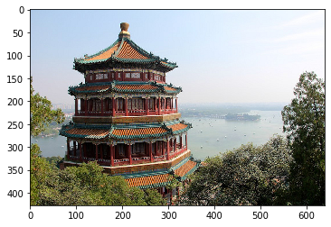


### Wait, what tool am I even using, what's Keras?
## More levers and buttons

Coding directly in **Tensorflow** allows you to tweak more parameters to optimize performance. The **Keras** wrapper makes the code more accessible for developers prototyping models.


### Keras, an API with an intentional UX

- Deliberately design end-to-end user workflows
- Reduce cognitive load for your users
- Provide helpful feedback to your users

[full article here](https://blog.keras.io/user-experience-design-for-apis.html)<br>
[full list of why to use Keras](https://keras.io/why-use-keras/)

### A few comparisons

While you **can leverage both**, here are a few comparisons.

| Comparison | Keras | Tensorflow|
|------------|-------|-----------|
| **Level of API** | high-level API | High and low-level APIs |
| **Speed** |  can *seem* slower |  is a bit faster |
| **Language architecture** | simple architecture, more readable and concise | straight tensorflow is a bit mroe complex |
| **Debugging** | less frequent need to debug | difficult to debug |
| **Datasets** | usually used for small datasets | high performance models and large datasets that require fast execution|

This is also a _**non-issue**_ - as you can leverage tensorflow commands within keras and vice versa. If Keras ever seems slower, it's because the developer's time is more expensive than the GPUs. Keras is designed with the developer in mind. 


[reference link](https://www.edureka.co/blog/keras-vs-tensorflow-vs-pytorch/)

### Think, Pair, Share Challenge:

</br>

Let's begin implementing our neural net with the UCI digit dataset we imported from sklearn yesterday.

Let's continue where we left off with our numbers dataset.


```python
from sklearn.datasets import load_digits
from sklearn.model_selection import train_test_split
digits = load_digits()
X = digits.data
y = digits.target

```

We will start with a binary classification, and predict whether the number will be even or odd.


```python
y_binary = y % 2
y_binary
```


    array([0, 1, 0, ..., 0, 1, 0])


In pairs, proceed through the following three parts. 

#### Part 1:
Questions to answer:
- How many input variables are there in this dataset? 
- What does the range of values (0-16) represent in our feature set?
- What does a 1 mean in our target class?
- If we use a neural net to predict this, what loss function do we use?
***

***
#### Part 2:
What if you wanted to create a NN with hidden layers to predict even numbers with:
- 12 nodes in the first hidden layer
- 8 nodes in the second hidden layer
- relu on the first two activations
- sigmoid on the last one

Answer the following questions:
- How many nodes in the input layer?
- How many nodes in the output layer?
- Will the output layer produce an integer or a float?
***

***

#### Part 3:
Knowing that you want:
- batch size of 10
- 50 epochs
- to use `rmsprop` as your optimizer
- and all the numbers you defined above...

**Fill out the code below with the correct specifications, but don't run it yet**


```python
model = Sequential()
model.add(Dense(   , activation= , input_dim= ))
model.add(Dense( ,  activation= ))
model.add(Dense(  , activation =  ))

model.compile(optimizer= ,
              loss=,
              metrics=['accuracy'])
model.fit(data, labels, epochs=, batch_size=  )
```


      File "<ipython-input-171-990b674031ad>", line 2
        model.add(Dense(   , activation= , input_dim= ))
                           ^
    SyntaxError: invalid syntax


```python
#__SOLUTION__

model = Sequential()
model.add(Dense(12, activation='relu', input_dim=64,))
model.add(Dense(8 ,  activation='relu' ))
model.add(Dense(1 , activation = 'sigmoid' ))

model.compile(optimizer='rmsprop' ,
              loss='binary_crossentropy'  ,
              metrics=['accuracy'])
model.fit(X, y_binary, epochs=50, batch_size= 10 )
```

    Epoch 1/50
    1797/1797 [==============================] - 2s 1ms/step - loss: 0.5585 - acc: 0.7446
    Epoch 2/50
    1797/1797 [==============================] - 0s 203us/step - loss: 0.2448 - acc: 0.9009
    Epoch 3/50
    1797/1797 [==============================] - 0s 198us/step - loss: 0.1640 - acc: 0.9349
    Epoch 4/50
    1797/1797 [==============================] - 0s 177us/step - loss: 0.1305 - acc: 0.9482
    Epoch 5/50
    1797/1797 [==============================] - 0s 177us/step - loss: 0.1068 - acc: 0.9638
    Epoch 6/50
    1797/1797 [==============================] - 0s 167us/step - loss: 0.0902 - acc: 0.9705
    Epoch 7/50
    1797/1797 [==============================] - 0s 159us/step - loss: 0.0793 - acc: 0.9716
    Epoch 8/50
    1797/1797 [==============================] - 0s 190us/step - loss: 0.0715 - acc: 0.9766
    Epoch 9/50
    1797/1797 [==============================] - 0s 179us/step - loss: 0.0621 - acc: 0.9789
    Epoch 10/50
    1797/1797 [==============================] - 0s 160us/step - loss: 0.0564 - acc: 0.9794
    Epoch 11/50
    1797/1797 [==============================] - 0s 157us/step - loss: 0.0516 - acc: 0.9822
    Epoch 12/50
    1797/1797 [==============================] - 0s 196us/step - loss: 0.0475 - acc: 0.9822
    Epoch 13/50
    1797/1797 [==============================] - 0s 168us/step - loss: 0.0417 - acc: 0.9861
    Epoch 14/50
    1797/1797 [==============================] - 0s 168us/step - loss: 0.0402 - acc: 0.9855
    Epoch 15/50
    1797/1797 [==============================] - 0s 203us/step - loss: 0.0351 - acc: 0.9894
    Epoch 16/50
    1797/1797 [==============================] - 0s 164us/step - loss: 0.0324 - acc: 0.9878
    Epoch 17/50
    1797/1797 [==============================] - 0s 175us/step - loss: 0.0292 - acc: 0.9905
    Epoch 18/50
    1797/1797 [==============================] - 0s 181us/step - loss: 0.0276 - acc: 0.9894
    Epoch 19/50
    1797/1797 [==============================] - 0s 164us/step - loss: 0.0248 - acc: 0.9905
    Epoch 20/50
    1797/1797 [==============================] - 0s 186us/step - loss: 0.0239 - acc: 0.9939
    Epoch 21/50
    1797/1797 [==============================] - 0s 179us/step - loss: 0.0211 - acc: 0.9933
    Epoch 22/50
    1797/1797 [==============================] - 0s 180us/step - loss: 0.0206 - acc: 0.9922
    Epoch 23/50
    1797/1797 [==============================] - 0s 164us/step - loss: 0.0193 - acc: 0.9922
    Epoch 24/50
    1797/1797 [==============================] - 0s 175us/step - loss: 0.0188 - acc: 0.9939
    Epoch 25/50
    1797/1797 [==============================] - 0s 172us/step - loss: 0.0142 - acc: 0.9972
    Epoch 26/50
    1797/1797 [==============================] - 0s 164us/step - loss: 0.0139 - acc: 0.9950
    Epoch 27/50
    1797/1797 [==============================] - 0s 160us/step - loss: 0.0117 - acc: 0.9967
    Epoch 28/50
    1797/1797 [==============================] - 0s 190us/step - loss: 0.0116 - acc: 0.9961
    Epoch 29/50
    1797/1797 [==============================] - 0s 186us/step - loss: 0.0106 - acc: 0.9950
    Epoch 30/50
    1797/1797 [==============================] - 0s 187us/step - loss: 0.0092 - acc: 0.9972
    Epoch 31/50
    1797/1797 [==============================] - 0s 193us/step - loss: 0.0120 - acc: 0.9955
    Epoch 32/50
    1797/1797 [==============================] - 0s 206us/step - loss: 0.0094 - acc: 0.9967
    Epoch 33/50
    1797/1797 [==============================] - 0s 218us/step - loss: 0.0082 - acc: 0.9983
    Epoch 34/50
    1797/1797 [==============================] - 0s 189us/step - loss: 0.0058 - acc: 0.9978
    Epoch 35/50
    1797/1797 [==============================] - 0s 176us/step - loss: 0.0081 - acc: 0.9972
    Epoch 36/50
    1797/1797 [==============================] - 0s 195us/step - loss: 0.0067 - acc: 0.9972
    Epoch 37/50
    1797/1797 [==============================] - 0s 181us/step - loss: 0.0066 - acc: 0.9983
    Epoch 38/50
    1797/1797 [==============================] - 0s 187us/step - loss: 0.0052 - acc: 0.9983
    Epoch 39/50
    1797/1797 [==============================] - 0s 203us/step - loss: 0.0035 - acc: 0.9989
    Epoch 40/50
    1797/1797 [==============================] - 0s 181us/step - loss: 0.0064 - acc: 0.9978
    Epoch 41/50
    1797/1797 [==============================] - 0s 178us/step - loss: 0.0043 - acc: 0.9972
    Epoch 42/50
    1797/1797 [==============================] - 0s 202us/step - loss: 0.0041 - acc: 0.9989
    Epoch 43/50
    1797/1797 [==============================] - 0s 199us/step - loss: 0.0037 - acc: 0.9994
    Epoch 44/50
    1797/1797 [==============================] - 0s 194us/step - loss: 0.0044 - acc: 0.9989
    Epoch 45/50
    1797/1797 [==============================] - 0s 222us/step - loss: 0.0041 - acc: 0.9989
    Epoch 46/50
    1797/1797 [==============================] - 0s 185us/step - loss: 0.0056 - acc: 0.9983
    Epoch 47/50
    1797/1797 [==============================] - 0s 191us/step - loss: 0.0027 - acc: 0.9994
    Epoch 48/50
    1797/1797 [==============================] - 0s 201us/step - loss: 0.0031 - acc: 0.9994
    Epoch 49/50
    1797/1797 [==============================] - 0s 167us/step - loss: 0.0023 - acc: 0.9994
    Epoch 50/50
    1797/1797 [==============================] - 0s 173us/step - loss: 0.0034 - acc: 0.9994


    <keras.callbacks.History at 0x1a60c6cda0>


### Things to know:
- the data and labels in `fit()` need to be numpy arrays, not pandas dfs. Else it won't work.
- Scaling your data will have a large impact on your model.   
  > For our traditional input features, we would use a scalar object.  For images, as long as the minimum value is 0, we can simply divide through by the maximum pixel intensity.


#### Getting data ready for modeling
**Tasks**:

- use train_test_split to create X_train, y_train, X_test, and y_test
- Split training data into train and validation sets.
- Scale the pixel intensity to a value between 0 and 1.
- Scale the pixel intensity to a value between 0 and 1.

Scaling data for neural networks is very important, whether it be for image processing or prediction problems like we've seen in past projects and lessons.  

Scaling our input variables will help speed up our neural network [see 4.3](http://yann.lecun.com/exdb/publis/pdf/lecun-98b.pdf)

Since our minimum intensity is 0, we can normalize the inputs by dividing each value by the max value (16). 


```python
# Your code here
```


```python
#__SOLUTION__
from sklearn.model_selection import train_test_split

X_train, X_test, y_train, y_test = train_test_split(X, y_binary, random_state=42, test_size=.2)
X_t, X_val, y_t, y_val = train_test_split(X_train, y_train, random_state=42, test_size=.2)
X_t, X_val, X_test = X_t/16, X_val/16, X_test/16

```

Now that our data is ready, let's load in keras


```python
from keras.models import Sequential
```


```python
from keras.layers import Dense
```

Let's start working through the different choices we can make in our network.

For activation, let's start with the familiar sigmoid function, and see how it performs.


```python
np.random.seed(42)
model = Sequential()
model.add(Dense(12, activation='sigmoid', input_dim=64,))
model.add(Dense(8 ,  activation='sigmoid' ))
model.add(Dense(1 , activation = 'sigmoid' ))

model.compile(optimizer='SGD' ,
              loss='binary_crossentropy'  ,
              metrics=['accuracy'])

# Assign the variable history to store the results, and set verbose=1 so we can see the output.
results = model.fit(X_t, y_t, epochs=10, batch_size=100, verbose=1)
```

    Epoch 1/10
    1149/1149 [==============================] - 2s 2ms/step - loss: 0.7928 - acc: 0.5039
    Epoch 2/10
    1149/1149 [==============================] - 0s 20us/step - loss: 0.7743 - acc: 0.5039
    Epoch 3/10
    1149/1149 [==============================] - 0s 19us/step - loss: 0.7593 - acc: 0.5039
    Epoch 4/10
    1149/1149 [==============================] - 0s 19us/step - loss: 0.7465 - acc: 0.5039
    Epoch 5/10
    1149/1149 [==============================] - 0s 22us/step - loss: 0.7360 - acc: 0.5039
    Epoch 6/10
    1149/1149 [==============================] - 0s 23us/step - loss: 0.7273 - acc: 0.5039
    Epoch 7/10
    1149/1149 [==============================] - 0s 22us/step - loss: 0.7200 - acc: 0.5039
    Epoch 8/10
    1149/1149 [==============================] - 0s 23us/step - loss: 0.7143 - acc: 0.5039
    Epoch 9/10
    1149/1149 [==============================] - 0s 23us/step - loss: 0.7094 - acc: 0.5039
    Epoch 10/10
    1149/1149 [==============================] - 0s 23us/step - loss: 0.7057 - acc: 0.5039


```python
import seaborn as sns
import matplotlib.pyplot as plt
import numpy as np


sigmoid_loss = results.history['loss']
sigmoid_accuracy = results.history['acc']

fig, (ax1, ax2) = plt.subplots(1,2, figsize=(10,5))
sns.lineplot(results.epoch, results.history['loss'], ax=ax1, label='loss')
sns.lineplot(results.epoch, results.history['acc'], ax=ax2, label='accuracy')
```


    <matplotlib.axes._subplots.AxesSubplot at 0x1a78466438>


If we look at our loss, it is still decreasing. That is a signal that our model is still learning. If our model is still learning, we can allow it to get better by increasing the number of epochs.


```python
model = Sequential()
model.add(Dense(12, activation='sigmoid', input_dim=64,))
model.add(Dense(8 ,  activation='sigmoid' ))
model.add(Dense(1 , activation = 'sigmoid' ))

model.compile(optimizer='SGD' ,
              loss='binary_crossentropy'  ,
              metrics=['accuracy'])

# Assign the variable history to store the results, and set verbose=1 so we can see the output.
results = model.fit(X_t, y_t, epochs=50, batch_size=23, verbose=1)
```

    Epoch 1/50
    1149/1149 [==============================] - 2s 2ms/step - loss: 0.7128 - acc: 0.4961
    Epoch 2/50
    1149/1149 [==============================] - 0s 79us/step - loss: 0.6964 - acc: 0.4961
    Epoch 3/50
    1149/1149 [==============================] - 0s 74us/step - loss: 0.6890 - acc: 0.4961
    Epoch 4/50
    1149/1149 [==============================] - 0s 75us/step - loss: 0.6852 - acc: 0.4961
    Epoch 5/50
    1149/1149 [==============================] - 0s 74us/step - loss: 0.6831 - acc: 0.5231
    Epoch 6/50
    1149/1149 [==============================] - 0s 75us/step - loss: 0.6818 - acc: 0.6762
    Epoch 7/50
    1149/1149 [==============================] - 0s 81us/step - loss: 0.6808 - acc: 0.7076
    Epoch 8/50
    1149/1149 [==============================] - 0s 78us/step - loss: 0.6800 - acc: 0.7389
    Epoch 9/50
    1149/1149 [==============================] - 0s 106us/step - loss: 0.6791 - acc: 0.7546
    Epoch 10/50
    1149/1149 [==============================] - 0s 90us/step - loss: 0.6783 - acc: 0.7720
    Epoch 11/50
    1149/1149 [==============================] - 0s 87us/step - loss: 0.6775 - acc: 0.7528
    Epoch 12/50
    1149/1149 [==============================] - 0s 83us/step - loss: 0.6766 - acc: 0.7702
    Epoch 13/50
    1149/1149 [==============================] - 0s 85us/step - loss: 0.6758 - acc: 0.7398
    Epoch 14/50
    1149/1149 [==============================] - 0s 81us/step - loss: 0.6749 - acc: 0.7920
    Epoch 15/50
    1149/1149 [==============================] - 0s 82us/step - loss: 0.6739 - acc: 0.7946
    Epoch 16/50
    1149/1149 [==============================] - 0s 86us/step - loss: 0.6730 - acc: 0.7380
    Epoch 17/50
    1149/1149 [==============================] - 0s 83us/step - loss: 0.6720 - acc: 0.8233
    Epoch 18/50
    1149/1149 [==============================] - 0s 98us/step - loss: 0.6710 - acc: 0.7781
    Epoch 19/50
    1149/1149 [==============================] - 0s 84us/step - loss: 0.6700 - acc: 0.8225
    Epoch 20/50
    1149/1149 [==============================] - 0s 90us/step - loss: 0.6690 - acc: 0.8155
    Epoch 21/50
    1149/1149 [==============================] - 0s 80us/step - loss: 0.6679 - acc: 0.8024
    Epoch 22/50
    1149/1149 [==============================] - 0s 81us/step - loss: 0.6668 - acc: 0.8138
    Epoch 23/50
    1149/1149 [==============================] - 0s 82us/step - loss: 0.6656 - acc: 0.7998
    Epoch 24/50
    1149/1149 [==============================] - 0s 83us/step - loss: 0.6644 - acc: 0.8111
    Epoch 25/50
    1149/1149 [==============================] - 0s 79us/step - loss: 0.6632 - acc: 0.8329
    Epoch 26/50
    1149/1149 [==============================] - 0s 84us/step - loss: 0.6619 - acc: 0.8581
    Epoch 27/50
    1149/1149 [==============================] - 0s 77us/step - loss: 0.6606 - acc: 0.8251
    Epoch 28/50
    1149/1149 [==============================] - 0s 85us/step - loss: 0.6593 - acc: 0.8581
    Epoch 29/50
    1149/1149 [==============================] - 0s 131us/step - loss: 0.6579 - acc: 0.8442
    Epoch 30/50
    1149/1149 [==============================] - 0s 87us/step - loss: 0.6565 - acc: 0.8494
    Epoch 31/50
    1149/1149 [==============================] - 0s 86us/step - loss: 0.6550 - acc: 0.8512
    Epoch 32/50
    1149/1149 [==============================] - 0s 89us/step - loss: 0.6534 - acc: 0.8512
    Epoch 33/50
    1149/1149 [==============================] - 0s 90us/step - loss: 0.6519 - acc: 0.8686
    Epoch 34/50
    1149/1149 [==============================] - 0s 91us/step - loss: 0.6502 - acc: 0.8512
    Epoch 35/50
    1149/1149 [==============================] - 0s 97us/step - loss: 0.6485 - acc: 0.8712
    Epoch 36/50
    1149/1149 [==============================] - 0s 98us/step - loss: 0.6468 - acc: 0.8764
    Epoch 37/50
    1149/1149 [==============================] - 0s 91us/step - loss: 0.6449 - acc: 0.8782
    Epoch 38/50
    1149/1149 [==============================] - 0s 96us/step - loss: 0.6431 - acc: 0.8590
    Epoch 39/50
    1149/1149 [==============================] - 0s 80us/step - loss: 0.6411 - acc: 0.8729
    Epoch 40/50
    1149/1149 [==============================] - 0s 75us/step - loss: 0.6391 - acc: 0.8703
    Epoch 41/50
    1149/1149 [==============================] - 0s 79us/step - loss: 0.6370 - acc: 0.8721
    Epoch 42/50
    1149/1149 [==============================] - 0s 87us/step - loss: 0.6348 - acc: 0.8729
    Epoch 43/50
    1149/1149 [==============================] - 0s 82us/step - loss: 0.6327 - acc: 0.8755
    Epoch 44/50
    1149/1149 [==============================] - 0s 82us/step - loss: 0.6303 - acc: 0.8747
    Epoch 45/50
    1149/1149 [==============================] - 0s 83us/step - loss: 0.6280 - acc: 0.8773
    Epoch 46/50
    1149/1149 [==============================] - 0s 85us/step - loss: 0.6255 - acc: 0.8782
    Epoch 47/50
    1149/1149 [==============================] - 0s 82us/step - loss: 0.6230 - acc: 0.8773
    Epoch 48/50
    1149/1149 [==============================] - 0s 84us/step - loss: 0.6204 - acc: 0.8764
    Epoch 49/50
    1149/1149 [==============================] - 0s 96us/step - loss: 0.6177 - acc: 0.8729
    Epoch 50/50
    1149/1149 [==============================] - 0s 88us/step - loss: 0.6149 - acc: 0.8790


```python
sigmoid_loss = results.history['loss']
sigmoid_accuracy = results.history['acc']

fig, (ax1, ax2) = plt.subplots(1,2, figsize=(10,5))
sns.lineplot(results.epoch, sigmoid_loss, ax=ax1, label='loss')
sns.lineplot(results.epoch, sigmoid_accuracy, ax=ax2, label='accuracy')
```


    <matplotlib.axes._subplots.AxesSubplot at 0x1a77863550>


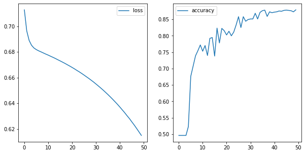


It still looks like our model has not converged.  The loss is still decreasing, and the accuracy is still increasing.  We could continue increasing the epochs, but that will be time consuming.  

We could try decreasing the batch size. Let's set the batch size to 1.  This is true stochastic gradient descent.  The parameters are updated after each sample is passed into the model.

SGD with a small batch size takes longer to run through an epoch, but will take less epochs to improve.


```python
model = Sequential()
model.add(Dense(12, activation='sigmoid', input_dim=64,))
model.add(Dense(8 ,  activation='sigmoid' ))
model.add(Dense(1 , activation = 'sigmoid' ))

model.compile(optimizer='SGD' ,
              loss='binary_crossentropy'  ,
              metrics=['accuracy'])

# Assign the variable history to store the results, and set verbose=1 so we can see the output.
results = model.fit(X_t, y_t, epochs=10, batch_size=1, verbose=1)
```

    Epoch 1/10
    1149/1149 [==============================] - 3s 2ms/step - loss: 0.6983 - acc: 0.5091
    Epoch 2/10
    1149/1149 [==============================] - 1s 1ms/step - loss: 0.6957 - acc: 0.4891
    Epoch 3/10
    1149/1149 [==============================] - 1s 1ms/step - loss: 0.6920 - acc: 0.5100
    Epoch 4/10
    1149/1149 [==============================] - 1s 1ms/step - loss: 0.6854 - acc: 0.5579
    Epoch 5/10
    1149/1149 [==============================] - 2s 1ms/step - loss: 0.6763 - acc: 0.6197
    Epoch 6/10
    1149/1149 [==============================] - 2s 1ms/step - loss: 0.6572 - acc: 0.7076
    Epoch 7/10
    1149/1149 [==============================] - 2s 1ms/step - loss: 0.6162 - acc: 0.7920
    Epoch 8/10
    1149/1149 [==============================] - 2s 1ms/step - loss: 0.5365 - acc: 0.8251
    Epoch 9/10
    1149/1149 [==============================] - 2s 1ms/step - loss: 0.4357 - acc: 0.8503
    Epoch 10/10
    1149/1149 [==============================] - 2s 1ms/step - loss: 0.3608 - acc: 0.8686


```python
sigmoid_one_loss = results.history['loss']
sigmoid_one_accuracy = results.history['acc']

fig, (ax1, ax2) = plt.subplots(1,2, figsize=(10,5))
sns.lineplot(results.epoch, sigmoid_one_loss, ax=ax1, label='loss')
sns.lineplot(results.epoch, sigmoid_one_accuracy, ax=ax2, label='accuracy')
```


    <matplotlib.axes._subplots.AxesSubplot at 0x1a48d6b400>


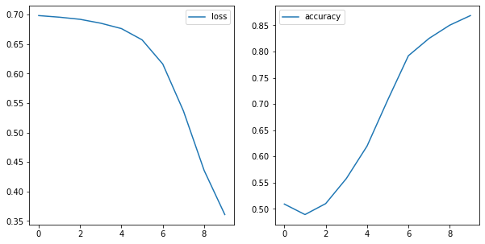


Comparing our 50 epoch version with a 500 batch size and a 10 epoch version with a 1 example batch size, we see that by 10 epochs, the latter has achieved 90% accuracy by the final epoch, while our 23 batch size is just about 70%.  However, with the 1 example batch, each epoch took a lot longer.

Still, even though the 2nd model reached a higher accuracy and lower loss, it looks like it still has not stopped learning. The slope of the loss is getting smaller, but it has not leveled out completely.


```python
from keras.optimizers import SGD

model = Sequential()

sgd = SGD(lr=.02)
model.add(Dense(12, activation='sigmoid', input_dim=64,))
model.add(Dense(8 ,  activation='sigmoid' ))
model.add(Dense(1 , activation = 'sigmoid' ))

model.compile(optimizer=sgd ,
              loss='binary_crossentropy'  ,
              metrics=['accuracy'])

# Assign the variable history to store the results, and set verbose=1 so we can see the output.
results = model.fit(X_t, y_t, epochs=10, batch_size=1, verbose=1)
```

    Epoch 1/10
    1149/1149 [==============================] - 4s 3ms/step - loss: 0.6922 - acc: 0.5370
    Epoch 2/10
    1149/1149 [==============================] - 2s 2ms/step - loss: 0.6586 - acc: 0.6501
    Epoch 3/10
    1149/1149 [==============================] - 2s 2ms/step - loss: 0.5514 - acc: 0.7868A: 0s - loss: 0.5544 - acc: 0.7
    Epoch 4/10
    1149/1149 [==============================] - 2s 2ms/step - loss: 0.3887 - acc: 0.8590
    Epoch 5/10
    1149/1149 [==============================] - 2s 2ms/step - loss: 0.3094 - acc: 0.8790
    Epoch 6/10
    1149/1149 [==============================] - 2s 1ms/step - loss: 0.2706 - acc: 0.8930
    Epoch 7/10
    1149/1149 [==============================] - 2s 2ms/step - loss: 0.2493 - acc: 0.8964
    Epoch 8/10
    1149/1149 [==============================] - 2s 2ms/step - loss: 0.2363 - acc: 0.8964
    Epoch 9/10
    1149/1149 [==============================] - 2s 2ms/step - loss: 0.2279 - acc: 0.9069
    Epoch 10/10
    1149/1149 [==============================] - 2s 2ms/step - loss: 0.2218 - acc: 0.9034


```python
relu_loss = results.history['loss']
relu_accuracy = results.history['acc']

fig, (ax1, ax2) = plt.subplots(1,2, figsize=(10,5))
sns.lineplot(results.epoch, relu_loss, ax=ax1, label='loss')
sns.lineplot(results.epoch, relu_accuracy, ax=ax2, label='accuracy')
```


    <matplotlib.axes._subplots.AxesSubplot at 0x1a7890d588>


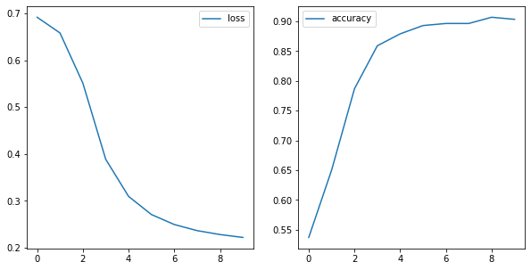


```python
from keras.optimizers import SGD

model = Sequential()

sgd = SGD(lr=9)
model.add(Dense(12, activation='sigmoid', input_dim=64,))
model.add(Dense(8 ,  activation='sigmoid' ))
model.add(Dense(1 , activation = 'sigmoid' ))

model.compile(optimizer=sgd ,
              loss='binary_crossentropy'  ,
              metrics=['accuracy'])

# Assign the variable history to store the results, and set verbose=1 so we can see the output.
results = model.fit(X_t, y_t, epochs=30, batch_size=32, verbose=1)

relu_loss = results.history['loss']
relu_accuracy = results.history['acc']

fig, (ax1, ax2) = plt.subplots(1,2, figsize=(10,5))
sns.lineplot(results.epoch, relu_loss, ax=ax1, label='loss')
sns.lineplot(results.epoch, relu_accuracy, ax=ax2, label='accuracy')
```

    Epoch 1/30
    1149/1149 [==============================] - 2s 2ms/step - loss: 1.0823 - acc: 0.4830
    Epoch 2/30
    1149/1149 [==============================] - 0s 63us/step - loss: 0.8540 - acc: 0.5022
    Epoch 3/30
    1149/1149 [==============================] - 0s 62us/step - loss: 0.8703 - acc: 0.5335
    Epoch 4/30
    1149/1149 [==============================] - 0s 62us/step - loss: 1.0088 - acc: 0.4926
    Epoch 5/30
    1149/1149 [==============================] - 0s 72us/step - loss: 0.8866 - acc: 0.4970
    Epoch 6/30
    1149/1149 [==============================] - 0s 60us/step - loss: 0.9379 - acc: 0.4804
    Epoch 7/30
    1149/1149 [==============================] - 0s 61us/step - loss: 0.8235 - acc: 0.5048
    Epoch 8/30
    1149/1149 [==============================] - 0s 70us/step - loss: 0.7988 - acc: 0.5222
    Epoch 9/30
    1149/1149 [==============================] - 0s 62us/step - loss: 0.9850 - acc: 0.4648
    Epoch 10/30
    1149/1149 [==============================] - 0s 85us/step - loss: 0.8171 - acc: 0.5065
    Epoch 11/30
    1149/1149 [==============================] - 0s 77us/step - loss: 0.9355 - acc: 0.5004
    Epoch 12/30
    1149/1149 [==============================] - 0s 77us/step - loss: 0.9954 - acc: 0.4708
    Epoch 13/30
    1149/1149 [==============================] - 0s 70us/step - loss: 0.8110 - acc: 0.5065
    Epoch 14/30
    1149/1149 [==============================] - 0s 68us/step - loss: 0.8468 - acc: 0.5100
    Epoch 15/30
    1149/1149 [==============================] - 0s 65us/step - loss: 0.7681 - acc: 0.5196
    Epoch 16/30
    1149/1149 [==============================] - 0s 73us/step - loss: 0.7550 - acc: 0.5257
    Epoch 17/30
    1149/1149 [==============================] - 0s 71us/step - loss: 0.8692 - acc: 0.4909
    Epoch 18/30
    1149/1149 [==============================] - 0s 64us/step - loss: 0.9378 - acc: 0.4935
    Epoch 19/30
    1149/1149 [==============================] - 0s 61us/step - loss: 0.9189 - acc: 0.4830
    Epoch 20/30
    1149/1149 [==============================] - 0s 66us/step - loss: 1.0753 - acc: 0.4552
    Epoch 21/30
    1149/1149 [==============================] - 0s 72us/step - loss: 1.0114 - acc: 0.4752
    Epoch 22/30
    1149/1149 [==============================] - 0s 76us/step - loss: 0.8504 - acc: 0.4978
    Epoch 23/30
    1149/1149 [==============================] - 0s 80us/step - loss: 0.8621 - acc: 0.4987
    Epoch 24/30
    1149/1149 [==============================] - 0s 64us/step - loss: 0.9982 - acc: 0.4743
    Epoch 25/30
    1149/1149 [==============================] - 0s 64us/step - loss: 1.0312 - acc: 0.4726
    Epoch 26/30
    1149/1149 [==============================] - 0s 67us/step - loss: 0.8277 - acc: 0.5039
    Epoch 27/30
    1149/1149 [==============================] - 0s 64us/step - loss: 0.8702 - acc: 0.5109
    Epoch 28/30
    1149/1149 [==============================] - 0s 63us/step - loss: 0.7832 - acc: 0.5431
    Epoch 29/30
    1149/1149 [==============================] - 0s 61us/step - loss: 0.8858 - acc: 0.4943
    Epoch 30/30
    1149/1149 [==============================] - 0s 75us/step - loss: 0.8511 - acc: 0.4900


    <matplotlib.axes._subplots.AxesSubplot at 0x1a7c4d9da0>


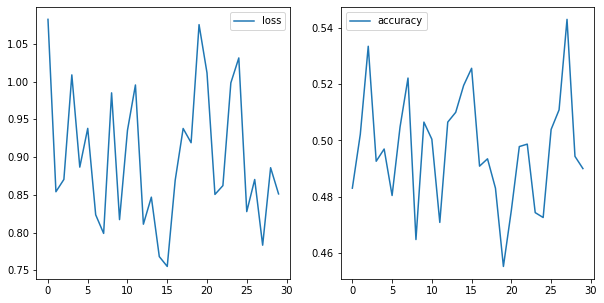


Let's get a bit more modern, and apply a relu activation function in our layers.


```python
model = Sequential()
model.add(Dense(12, activation='relu', input_dim=64,))
model.add(Dense(8 ,  activation='relu' ))
model.add(Dense(1 , activation = 'sigmoid' ))

model.compile(optimizer='SGD',
              loss='binary_crossentropy',
              metrics=['accuracy'])

# We can tinker with verbose to show the output
results = model.fit(X_t, y_t, epochs=50, batch_size= 32, verbose=0)
```


```python
relu_loss = results.history['loss']
relu_accuracy = results.history['acc']

fig, (ax1, ax2) = plt.subplots(1,2, figsize=(10,5))
sns.lineplot(results.epoch, relu_loss, ax=ax1, label='loss')
sns.lineplot(results.epoch, relu_accuracy, ax=ax2, label='accuracy')
```


    <matplotlib.axes._subplots.AxesSubplot at 0x1a48f6a518>


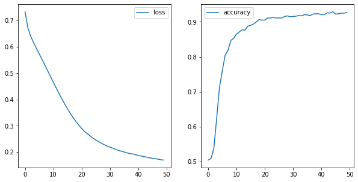


```python
model = Sequential()
model.add(Dense(12, activation='relu', input_dim=64,))
model.add(Dense(8 ,  activation='relu' ))
model.add(Dense(1 , activation = 'sigmoid' ))

model.compile(optimizer='SGD',
              loss='binary_crossentropy',
              metrics=['accuracy'])

# We can tinker with verbose to show the output
results = model.fit(X_t, y_t, epochs=10, batch_size= 1, verbose=1)
```

    Epoch 1/10
    1149/1149 [==============================] - 3s 2ms/step - loss: 0.5115 - acc: 0.7424
    Epoch 2/10
    1149/1149 [==============================] - 1s 1ms/step - loss: 0.2565 - acc: 0.8938
    Epoch 3/10
    1149/1149 [==============================] - 2s 1ms/step - loss: 0.2175 - acc: 0.9156
    Epoch 4/10
    1149/1149 [==============================] - 2s 1ms/step - loss: 0.1797 - acc: 0.9252
    Epoch 5/10
    1149/1149 [==============================] - 2s 1ms/step - loss: 0.1553 - acc: 0.9373
    Epoch 6/10
    1149/1149 [==============================] - 2s 1ms/step - loss: 0.1380 - acc: 0.9426
    Epoch 7/10
    1149/1149 [==============================] - 2s 1ms/step - loss: 0.1094 - acc: 0.9521
    Epoch 8/10
    1149/1149 [==============================] - 2s 2ms/step - loss: 0.0938 - acc: 0.9661
    Epoch 9/10
    1149/1149 [==============================] - 2s 1ms/step - loss: 0.0828 - acc: 0.9704
    Epoch 10/10
    1149/1149 [==============================] - 2s 2ms/step - loss: 0.0710 - acc: 0.9730


```python
relu_loss = results.history['loss']
relu_accuracy = results.history['acc']

fig, (ax1, ax2) = plt.subplots(1,2, figsize=(10,5))
sns.lineplot(results.epoch, relu_loss, ax=ax1, label='loss')
sns.lineplot(results.epoch, relu_accuracy, ax=ax2, label='accuracy')
```


    <matplotlib.axes._subplots.AxesSubplot at 0x1a4951c160>


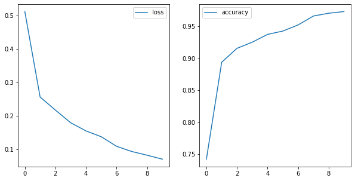


We are reaching a high accuracy, but still looks like our model has not converged. If we increased our number of epochs, we would be looking at a long wait.

We have been implementing the vanilla version of gradient descent.  Remember, SGD updates the parameters uniformly across the board.  Let's try out an optimizer used more often these days.


```python
model = Sequential()
model.add(Dense(12, activation='relu', input_dim=64,))
model.add(Dense(8 ,  activation='relu' ))
model.add(Dense(1 , activation = 'sigmoid' ))

model.compile(optimizer='adam',
              loss='binary_crossentropy',
              metrics=['accuracy'])

# We can tinker with verbose to show the output
results = model.fit(X_t, y_t, epochs=50, batch_size= 32, verbose=0)

relu_loss = results.history['loss']
relu_accuracy = results.history['acc']

fig, (ax1, ax2) = plt.subplots(1,2, figsize=(10,5))
sns.lineplot(results.epoch, relu_loss, ax=ax1, label='loss')
sns.lineplot(results.epoch, relu_accuracy, ax=ax2, label='accuracy')
```


    <matplotlib.axes._subplots.AxesSubplot at 0x1a4a522f28>


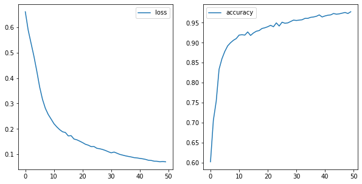


Now our accuracy is really improving, and it looks like our learning may be leveling out.

Since Adam and relu are relatively faster than SGD and sigmoid, we can add more epochs, and more layers without the training time getting unwieldy.


```python
model = Sequential()
model.add(Dense(12, activation='relu', input_dim=64,))
model.add(Dense(8 ,  activation='relu' ))
model.add(Dense(4 ,  activation='relu' ))
model.add(Dense(1 , activation = 'sigmoid' ))

model.compile(optimizer='adam',
              loss='binary_crossentropy',
              metrics=['accuracy'])

results = model.fit(X_t, y_t, epochs=100, batch_size= 32, verbose=0)

adam_loss = results.history['loss']
adam_accuracy = results.history['acc']

fig, (ax1, ax2) = plt.subplots(1,2, figsize=(10,5))
sns.lineplot(results.epoch, adam_loss, ax=ax1, label='loss')
sns.lineplot(results.epoch, adam_accuracy, ax=ax2, label='accuracy')
```


    <matplotlib.axes._subplots.AxesSubplot at 0x1a49d8edd8>


No it looks like we're getting somewhere.

For comparison, look at how much more quickly Adam learns than SGD.


```python
model = Sequential()
model.add(Dense(12, activation='relu', input_dim=64,))
model.add(Dense(8 ,  activation='relu' ))
model.add(Dense(4 ,  activation='relu' ))
model.add(Dense(1 , activation = 'sigmoid' ))

model.compile(optimizer='SGD',
              loss='binary_crossentropy',
              metrics=['accuracy'])

results = model.fit(X_t, y_t, epochs=100, batch_size= 32, verbose=0)

sgd_loss = results.history['loss']
sgd_accuracy = results.history['acc']

fig, (ax1, ax2) = plt.subplots(1,2, figsize=(10,5))
sns.lineplot(results.epoch, adam_loss, ax=ax1, label='adam_loss')
sns.lineplot(results.epoch, adam_accuracy, ax=ax2, label='adam_accuracy')

sns.lineplot(results.epoch, sgd_loss, ax=ax1, label='sgd_loss')
sns.lineplot(results.epoch, sgd_accuracy, ax=ax2, label='sgd_accuracy')
```


    <matplotlib.axes._subplots.AxesSubplot at 0x1a4aafc1d0>


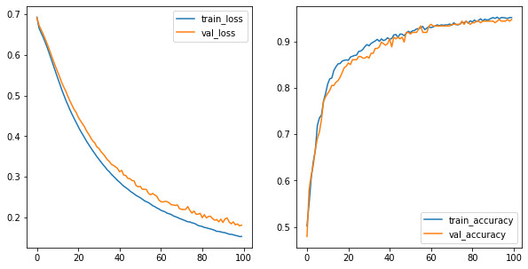


We have been looking only at our training set. Let's add in our validation set to the picture.


```python
model = Sequential()
model.add(Dense(12, activation='relu', input_dim=64,))
model.add(Dense(8 ,  activation='relu' ))
model.add(Dense(4 ,  activation='relu' ))
model.add(Dense(1 , activation = 'sigmoid' ))

model.compile(optimizer='SGD',
              loss='binary_crossentropy',
              metrics=['accuracy'])

results = model.fit(X_t, y_t, epochs=100, batch_size= 32, verbose=0, validation_data=(X_val, y_val))

train_loss = results.history['loss']
train_acc = results.history['acc']
val_loss = results.history['val_loss']
val_acc = results.history['val_acc']

fig, (ax1, ax2) = plt.subplots(1,2, figsize=(10,5))
sns.lineplot(results.epoch, train_loss, ax=ax1, label='train_loss')
sns.lineplot(results.epoch, train_acc, ax=ax2, label='train_accuracy')

sns.lineplot(results.epoch, val_loss, ax=ax1, label='val_loss')
sns.lineplot(results.epoch, val_acc, ax=ax2, label='val_accuracy')
```


    <matplotlib.axes._subplots.AxesSubplot at 0x1a48d2d9b0>


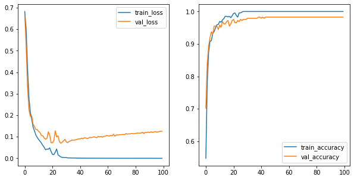


Consider that we still see our loss decreasing and our accuracy increasing.  We try to add more complexity to our model by adding more layers.


```python
np.random.seed(42)

model = Sequential()
model.add(Dense(30, activation='relu', input_dim=64,))
model.add(Dense(20 ,  activation='relu' ))

model.add(Dense(12 ,  activation='relu' ))
model.add(Dense(12 ,  activation='relu' ))
model.add(Dense(12 ,  activation='relu' ))
model.add(Dense(8 ,  activation='relu' ))
model.add(Dense(4 ,  activation='relu' ))
model.add(Dense(1 , activation = 'sigmoid' ))

model.compile(optimizer='adam',
              loss='binary_crossentropy',
              metrics=['accuracy'])

results = model.fit(X_t, y_t, epochs=100, batch_size= 32, verbose=0, validation_data=(X_val, y_val))

train_loss = results.history['loss']
train_acc = results.history['acc']
val_loss = results.history['val_loss']
val_acc = results.history['val_acc']


fig, (ax1, ax2) = plt.subplots(1,2, figsize=(10,5))
sns.lineplot(results.epoch, train_loss, ax=ax1, label='train_loss')
sns.lineplot(results.epoch, train_acc, ax=ax2, label='train_accuracy')

sns.lineplot(results.epoch, val_loss, ax=ax1, label='val_loss')
sns.lineplot(results.epoch, val_acc, ax=ax2, label='val_accuracy')
```


    <matplotlib.axes._subplots.AxesSubplot at 0x1a76c31898>


```python
np.random.seed(42)

model = Sequential()
model.add(Dense(300, activation='relu', input_dim=64,))
model.add(Dense(200 ,  activation='relu' ))

model.add(Dense(80 ,  activation='relu' ))
model.add(Dense(4 ,  activation='relu' ))
model.add(Dense(1 , activation = 'sigmoid' ))

model.compile(optimizer='adam',
              loss='binary_crossentropy',
              metrics=['accuracy'])

results = model.fit(X_t, y_t, epochs=100, batch_size= 32, verbose=0, validation_data=(X_val, y_val))

train_loss = results.history['loss']
train_acc = results.history['acc']
val_loss = results.history['val_loss']
val_acc = results.history['val_acc']


fig, (ax1, ax2) = plt.subplots(1,2, figsize=(10,5))
sns.lineplot(results.epoch, train_loss, ax=ax1, label='train_loss')
sns.lineplot(results.epoch, train_acc, ax=ax2, label='train_accuracy')

sns.lineplot(results.epoch, val_loss, ax=ax1, label='val_loss')
sns.lineplot(results.epoch, val_acc, ax=ax2, label='val_accuracy')
```


    <matplotlib.axes._subplots.AxesSubplot at 0x1a509baf98>


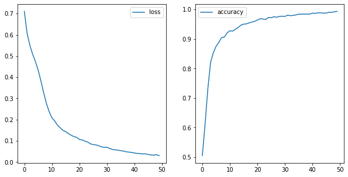


We see that our model is overfit.  Just like in our previous models, after a certain amount of learning, the loss on the validation set starts increasing.

# Regularization


Does regularization make sense in the context of neural networks? <br/>

Yes! We still have all of the salient ingredients: a loss function, overfitting vs. underfitting, and coefficients (weights) that could get too large.

But there are now a few different flavors besides L1 and L2 regularization. (Note that L1 regularization is not common in the context of  neural networks.)


```python
from keras import regularizers
```


```python
np.random.seed(42)

model = Sequential()
model.add(Dense(30, activation='relu', input_dim=64,))
model.add(Dense(20 ,  activation='relu', kernel_regularizer=regularizers.l2(0.01)))

model.add(Dense(12 ,  activation='relu'))
model.add(Dense(12 ,  activation='relu',  ))
model.add(Dense(12 ,  activation='relu', ))
model.add(Dense(8 ,  activation='relu' ,))
model.add(Dense(4 ,  activation='relu'))
model.add(Dense(1 , activation = 'sigmoid' ))

model.compile(optimizer='adam',
              loss='binary_crossentropy',
              metrics=['accuracy'])

results = model.fit(X_t, y_t, epochs=100, batch_size= 32, verbose=0, validation_data=(X_val, y_val))

train_loss = results.history['loss']
train_acc = results.history['acc']
val_loss = results.history['val_loss']
val_acc = results.history['val_acc']


fig, (ax1, ax2) = plt.subplots(1,2, figsize=(10,5))
sns.lineplot(results.epoch, train_loss, ax=ax1, label='train_loss')
sns.lineplot(results.epoch, train_acc, ax=ax2, label='train_accuracy')

sns.lineplot(results.epoch, val_loss, ax=ax1, label='val_loss')
sns.lineplot(results.epoch, val_acc, ax=ax2, label='val_accuracy')
```


    <matplotlib.axes._subplots.AxesSubplot at 0x1a7f4fee80>


```python
np.random.seed(42)

model = Sequential()
model.add(Dense(30, activation='relu', input_dim=64,))
model.add(Dense(20 ,  activation='relu', kernel_regularizer=regularizers.l2(0.01)))

model.add(Dense(12 ,  activation='relu', kernel_regularizer=regularizers.l2(0.01)))
model.add(Dense(12 ,  activation='relu', kernel_regularizer=regularizers.l2(0.01) ))
model.add(Dense(12 ,  activation='relu', kernel_regularizer=regularizers.l2(0.01)))
model.add(Dense(8 ,  activation='relu' , kernel_regularizer=regularizers.l2(0.01)))
model.add(Dense(4 ,  activation='relu', kernel_regularizer=regularizers.l2(0.01) ))
model.add(Dense(1 , activation = 'sigmoid' ))

model.compile(optimizer='adam',
              loss='binary_crossentropy',
              metrics=['accuracy'])

results = model.fit(X_t, y_t, epochs=100, batch_size= 32, verbose=0, validation_data=(X_val, y_val))

train_loss = results.history['loss']
train_acc = results.history['acc']
val_loss = results.history['val_loss']
val_acc = results.history['val_acc']


fig, (ax1, ax2) = plt.subplots(1,2, figsize=(10,5))
sns.lineplot(results.epoch, train_loss, ax=ax1, label='train_loss')
sns.lineplot(results.epoch, train_acc, ax=ax2, label='train_accuracy')

sns.lineplot(results.epoch, val_loss, ax=ax1, label='val_loss')
sns.lineplot(results.epoch, val_acc, ax=ax2, label='val_accuracy')
```


    <matplotlib.axes._subplots.AxesSubplot at 0x1a802689e8>


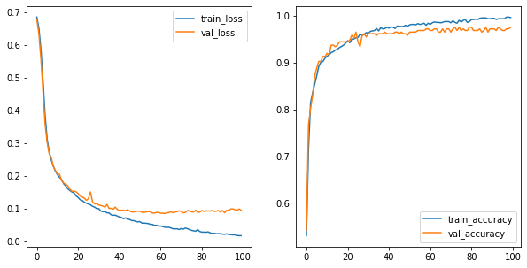


```python
from keras.layers import Dropout
```


```python
np.random.seed(42)

model = Sequential()
model.add(Dense(300, activation='relu', input_dim=64,))
model.add(Dropout(.3))
model.add(Dense(200 ,  activation='relu' ))
model.add(Dropout(.2))
model.add(Dense(80 ,  activation='relu' ))
model.add(Dropout(.01))
model.add(Dense(4 ,  activation='relu' ))
model.add(Dense(1 , activation = 'sigmoid' ))

model.compile(optimizer='adam',
              loss='binary_crossentropy',
              metrics=['accuracy'])

results = model.fit(X_t, y_t, epochs=100, batch_size= 32, verbose=0, validation_data=(X_val, y_val))

train_loss = results.history['loss']
train_acc = results.history['acc']
val_loss = results.history['val_loss']
val_acc = results.history['val_acc']


fig, (ax1, ax2) = plt.subplots(1,2, figsize=(10,5))
sns.lineplot(results.epoch, train_loss, ax=ax1, label='train_loss')
sns.lineplot(results.epoch, train_acc, ax=ax2, label='train_accuracy')

sns.lineplot(results.epoch, val_loss, ax=ax1, label='val_loss')
sns.lineplot(results.epoch, val_acc, ax=ax2, label='val_accuracy')
```


    <matplotlib.axes._subplots.AxesSubplot at 0x1a6420d320>


# Early Stopping


```python
from keras.callbacks import EarlyStopping

```


```python
np.random.seed(42)

model = Sequential()
model.add(Dense(30, activation='relu', input_dim=64,))
model.add(Dense(20 ,  activation='relu' ))

model.add(Dense(12 ,  activation='relu' ))
model.add(Dense(12 ,  activation='relu' ))
model.add(Dense(12 ,  activation='relu' ))
model.add(Dense(8 ,  activation='relu' ))
model.add(Dense(4 ,  activation='relu' ))
model.add(Dense(1 , activation = 'sigmoid' ))

model.compile(optimizer='adam',
              loss='binary_crossentropy',
              metrics=['accuracy'])

results = model.fit(X_t, y_t, epochs=100, batch_size= 32, verbose=0, validation_data=(X_val, y_val))

train_loss = results.history['loss']
train_acc = results.history['acc']
val_loss = results.history['val_loss']
val_acc = results.history['val_acc']


fig, (ax1, ax2) = plt.subplots(1,2, figsize=(10,5))
sns.lineplot(results.epoch, train_loss, ax=ax1, label='train_loss')
sns.lineplot(results.epoch, train_acc, ax=ax2, label='train_accuracy')

sns.lineplot(results.epoch, val_loss, ax=ax1, label='val_loss')
sns.lineplot(results.epoch, val_acc, ax=ax2, label='val_accuracy')
```


    <matplotlib.axes._subplots.AxesSubplot at 0x1a819c9710>


```python
np.random.seed(42)

model = Sequential()
model.add(Dense(30, activation='relu', input_dim=64,))
model.add(Dense(20 ,  activation='relu' ))

model.add(Dense(12 ,  activation='relu' ))
model.add(Dense(12 ,  activation='relu' ))
model.add(Dense(12 ,  activation='relu' ))
model.add(Dense(8 ,  activation='relu' ))
model.add(Dense(4 ,  activation='relu' ))
model.add(Dense(1 , activation = 'sigmoid' ))

model.compile(optimizer='adam',
              loss='binary_crossentropy',
              metrics=['accuracy'])

early_stop = EarlyStopping(monitor='val_loss', min_delta=1e-8, patience=0, verbose=1,
                           mode='min')
results = model.fit(X_t, y_t, epochs=100, batch_size= 32, verbose=0, validation_data=(X_val, y_val),
                   callbacks=[early_stop])


train_loss = results.history['loss']
train_acc = results.history['acc']
val_loss = results.history['val_loss']
val_acc = results.history['val_acc']


fig, (ax1, ax2) = plt.subplots(1,2, figsize=(10,5))
sns.lineplot(results.epoch, train_loss, ax=ax1, label='train_loss')
sns.lineplot(results.epoch, train_acc, ax=ax2, label='train_accuracy')

sns.lineplot(results.epoch, val_loss, ax=ax1, label='val_loss')
sns.lineplot(results.epoch, val_acc, ax=ax2, label='val_accuracy')
```

    Epoch 00006: early stopping


    <matplotlib.axes._subplots.AxesSubplot at 0x1a8376f1d0>


```python
np.random.seed(42)

model = Sequential()
model.add(Dense(30, activation='relu', input_dim=64,))
model.add(Dense(20 ,  activation='relu' ))

model.add(Dense(12 ,  activation='relu' ))
model.add(Dense(12 ,  activation='relu' ))
model.add(Dense(12 ,  activation='relu' ))
model.add(Dense(8 ,  activation='relu' ))
model.add(Dense(4 ,  activation='relu' ))
model.add(Dense(1 , activation = 'sigmoid' ))

model.compile(optimizer='adam',
              loss='binary_crossentropy',
              metrics=['accuracy'])

early_stop = EarlyStopping(monitor='val_loss', min_delta=1e-8, patience=15, verbose=1,
                           mode='min')
results = model.fit(X_t, y_t, epochs=100, batch_size= 32, verbose=0, validation_data=(X_val, y_val),
                   callbacks=[early_stop])


train_loss = results.history['loss']
train_acc = results.history['acc']
val_loss = results.history['val_loss']
val_acc = results.history['val_acc']


fig, (ax1, ax2) = plt.subplots(1,2, figsize=(10,5))
sns.lineplot(results.epoch, train_loss, ax=ax1, label='train_loss')
sns.lineplot(results.epoch, train_acc, ax=ax2, label='train_accuracy')

sns.lineplot(results.epoch, val_loss, ax=ax1, label='val_loss')
sns.lineplot(results.epoch, val_acc, ax=ax2, label='val_accuracy')
```

    Epoch 00044: early stopping


    <matplotlib.axes._subplots.AxesSubplot at 0x1a4e63ef28>


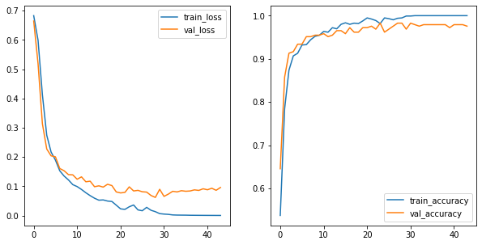


Now let's return to the original problem: predicting 0 through 9


```python
from sklearn.datasets import load_digits
from sklearn.model_selection import train_test_split
digits = load_digits()
X = digits.data
y = digits.target
```


```python
from sklearn.model_selection import train_test_split

X_train, X_test, y_train, y_test = train_test_split(X, y, random_state=42, test_size=.2)
X_t, X_val, y_t, y_val = train_test_split(X_train, y_train, random_state=42, test_size=.2)
X_t, X_val, X_test = X_t/16, X_val/16, X_test/16

```


```python
from sklearn.preprocessing import OneHotEncoder

ohe = OneHotEncoder(sparse=False)
y_t = ohe.fit_transform(y_t.reshape(-1,1))
y_val = ohe.transform(y_val.reshape(-1,1))
y_test = ohe.transform(y_test.reshape(-1,1))
```


```python
model = Sequential()
model.add(Dense(12, activation='relu', input_dim=64,))
model.add(Dense(8 ,  activation='relu' ))
model.add(Dense(10 , activation = 'softmax' ))

model.compile(optimizer='adam',
              loss='categorical_crossentropy'  ,
              metrics=['accuracy'])
results = model.fit(X_t, y_t, epochs=50, batch_size= 10, validation_data=(X_val, y_val))
```

    Train on 1149 samples, validate on 288 samples
    Epoch 1/50
    1149/1149 [==============================] - 2s 2ms/step - loss: 2.2504 - acc: 0.2019 - val_loss: 2.1269 - val_acc: 0.3021
    Epoch 2/50
    1149/1149 [==============================] - 0s 226us/step - loss: 2.0117 - acc: 0.3029 - val_loss: 1.8210 - val_acc: 0.3403
    Epoch 3/50
    1149/1149 [==============================] - 0s 230us/step - loss: 1.6898 - acc: 0.4439 - val_loss: 1.4530 - val_acc: 0.5556
    Epoch 4/50
    1149/1149 [==============================] - 0s 246us/step - loss: 1.2976 - acc: 0.6240 - val_loss: 1.0906 - val_acc: 0.6806
    Epoch 5/50
    1149/1149 [==============================] - 0s 230us/step - loss: 0.9716 - acc: 0.7076 - val_loss: 0.8386 - val_acc: 0.7188
    Epoch 6/50
    1149/1149 [==============================] - 0s 228us/step - loss: 0.7691 - acc: 0.7615 - val_loss: 0.6954 - val_acc: 0.7917
    Epoch 7/50
    1149/1149 [==============================] - 0s 225us/step - loss: 0.6380 - acc: 0.8207 - val_loss: 0.5773 - val_acc: 0.8125
    Epoch 8/50
    1149/1149 [==============================] - 0s 228us/step - loss: 0.5456 - acc: 0.8442 - val_loss: 0.4966 - val_acc: 0.8472
    Epoch 9/50
    1149/1149 [==============================] - 0s 209us/step - loss: 0.4752 - acc: 0.8634 - val_loss: 0.4744 - val_acc: 0.8437
    Epoch 10/50
    1149/1149 [==============================] - 0s 213us/step - loss: 0.4222 - acc: 0.8834 - val_loss: 0.3876 - val_acc: 0.8924
    Epoch 11/50
    1149/1149 [==============================] - 0s 238us/step - loss: 0.3765 - acc: 0.9060 - val_loss: 0.3538 - val_acc: 0.9028
    Epoch 12/50
    1149/1149 [==============================] - 0s 252us/step - loss: 0.3415 - acc: 0.9051 - val_loss: 0.3270 - val_acc: 0.9062
    Epoch 13/50
    1149/1149 [==============================] - 0s 199us/step - loss: 0.3125 - acc: 0.9191 - val_loss: 0.3016 - val_acc: 0.9132
    Epoch 14/50
    1149/1149 [==============================] - 0s 203us/step - loss: 0.2870 - acc: 0.9252 - val_loss: 0.2827 - val_acc: 0.9167
    Epoch 15/50
    1149/1149 [==============================] - 0s 278us/step - loss: 0.2673 - acc: 0.9278 - val_loss: 0.2623 - val_acc: 0.9236
    Epoch 16/50
    1149/1149 [==============================] - 0s 219us/step - loss: 0.2444 - acc: 0.9382 - val_loss: 0.2598 - val_acc: 0.9167
    Epoch 17/50
    1149/1149 [==============================] - 0s 202us/step - loss: 0.2295 - acc: 0.9382 - val_loss: 0.2416 - val_acc: 0.9236
    Epoch 18/50
    1149/1149 [==============================] - 0s 201us/step - loss: 0.2172 - acc: 0.9373 - val_loss: 0.2411 - val_acc: 0.9167
    Epoch 19/50
    1149/1149 [==============================] - 0s 231us/step - loss: 0.2031 - acc: 0.9487 - val_loss: 0.2143 - val_acc: 0.9410
    Epoch 20/50
    1149/1149 [==============================] - 0s 261us/step - loss: 0.1905 - acc: 0.9478 - val_loss: 0.2008 - val_acc: 0.9375
    Epoch 21/50
    1149/1149 [==============================] - 0s 254us/step - loss: 0.1801 - acc: 0.9521 - val_loss: 0.2048 - val_acc: 0.9340
    Epoch 22/50
    1149/1149 [==============================] - 0s 254us/step - loss: 0.1721 - acc: 0.9547 - val_loss: 0.1848 - val_acc: 0.9444
    Epoch 23/50
    1149/1149 [==============================] - 0s 249us/step - loss: 0.1590 - acc: 0.9582 - val_loss: 0.1824 - val_acc: 0.9410
    Epoch 24/50
    1149/1149 [==============================] - 0s 237us/step - loss: 0.1489 - acc: 0.9600 - val_loss: 0.1726 - val_acc: 0.9549
    Epoch 25/50
    1149/1149 [==============================] - 0s 236us/step - loss: 0.1433 - acc: 0.9652 - val_loss: 0.1678 - val_acc: 0.9479
    Epoch 26/50
    1149/1149 [==============================] - 0s 226us/step - loss: 0.1363 - acc: 0.9669 - val_loss: 0.1620 - val_acc: 0.9514
    Epoch 27/50
    1149/1149 [==============================] - 0s 216us/step - loss: 0.1282 - acc: 0.9687 - val_loss: 0.1624 - val_acc: 0.9549
    Epoch 28/50
    1149/1149 [==============================] - 0s 214us/step - loss: 0.1219 - acc: 0.9704 - val_loss: 0.1614 - val_acc: 0.9583
    Epoch 29/50
    1149/1149 [==============================] - 0s 213us/step - loss: 0.1175 - acc: 0.9739 - val_loss: 0.1546 - val_acc: 0.9583
    Epoch 30/50
    1149/1149 [==============================] - 0s 220us/step - loss: 0.1122 - acc: 0.9713 - val_loss: 0.1712 - val_acc: 0.9410
    Epoch 31/50
    1149/1149 [==============================] - 0s 237us/step - loss: 0.1069 - acc: 0.9774 - val_loss: 0.1475 - val_acc: 0.9618
    Epoch 32/50
    1149/1149 [==============================] - 0s 213us/step - loss: 0.1015 - acc: 0.9765 - val_loss: 0.1341 - val_acc: 0.9687
    Epoch 33/50
    1149/1149 [==============================] - 0s 224us/step - loss: 0.0977 - acc: 0.9765 - val_loss: 0.1353 - val_acc: 0.9653
    Epoch 34/50
    1149/1149 [==============================] - 0s 222us/step - loss: 0.0923 - acc: 0.9791 - val_loss: 0.1314 - val_acc: 0.9583
    Epoch 35/50
    1149/1149 [==============================] - 0s 242us/step - loss: 0.0889 - acc: 0.9817 - val_loss: 0.1276 - val_acc: 0.9618
    Epoch 36/50
    1149/1149 [==============================] - 0s 229us/step - loss: 0.0847 - acc: 0.9809 - val_loss: 0.1276 - val_acc: 0.9653
    Epoch 37/50
    1149/1149 [==============================] - 0s 242us/step - loss: 0.0816 - acc: 0.9852 - val_loss: 0.1181 - val_acc: 0.9687
    Epoch 38/50
    1149/1149 [==============================] - 0s 260us/step - loss: 0.0781 - acc: 0.9835 - val_loss: 0.1175 - val_acc: 0.9722
    Epoch 39/50
    1149/1149 [==============================] - 0s 235us/step - loss: 0.0780 - acc: 0.9852 - val_loss: 0.1206 - val_acc: 0.9583
    Epoch 40/50
    1149/1149 [==============================] - 0s 235us/step - loss: 0.0721 - acc: 0.9887 - val_loss: 0.1093 - val_acc: 0.9722
    Epoch 41/50
    1149/1149 [==============================] - 0s 234us/step - loss: 0.0701 - acc: 0.9861 - val_loss: 0.1160 - val_acc: 0.9687
    Epoch 42/50
    1149/1149 [==============================] - 0s 234us/step - loss: 0.0669 - acc: 0.9887 - val_loss: 0.1103 - val_acc: 0.9653
    Epoch 43/50
    1149/1149 [==============================] - 0s 211us/step - loss: 0.0642 - acc: 0.9869 - val_loss: 0.1047 - val_acc: 0.9653
    Epoch 44/50
    1149/1149 [==============================] - 0s 219us/step - loss: 0.0621 - acc: 0.9878 - val_loss: 0.1001 - val_acc: 0.9687
    Epoch 45/50
    1149/1149 [==============================] - 0s 220us/step - loss: 0.0584 - acc: 0.9922 - val_loss: 0.0977 - val_acc: 0.9653
    Epoch 46/50
    1149/1149 [==============================] - 0s 231us/step - loss: 0.0569 - acc: 0.9913 - val_loss: 0.0983 - val_acc: 0.9722
    Epoch 47/50
    1149/1149 [==============================] - 0s 226us/step - loss: 0.0556 - acc: 0.9913 - val_loss: 0.0976 - val_acc: 0.9687
    Epoch 48/50
    1149/1149 [==============================] - 0s 229us/step - loss: 0.0530 - acc: 0.9904 - val_loss: 0.0992 - val_acc: 0.9653
    Epoch 49/50
    1149/1149 [==============================] - 0s 216us/step - loss: 0.0520 - acc: 0.9913 - val_loss: 0.0999 - val_acc: 0.9653
    Epoch 50/50
    1149/1149 [==============================] - 0s 235us/step - loss: 0.0486 - acc: 0.9922 - val_loss: 0.0996 - val_acc: 0.9687


```python
history = results.history
training_loss = history['loss']
val_loss = history['val_loss']
training_accuracy = history['acc']
val_accuracy = history['val_acc']

```


```python
import matplotlib.pyplot as plt
import seaborn as sns
fig, (ax1,ax2) = plt.subplots(1,2,figsize=(15,5))


sns.lineplot(list(range(len(training_loss))), training_loss, c='r', label='training', ax=ax1)
sns.lineplot(list(range(len(val_loss))), val_loss, c='b', label='validation', ax=ax1)
sns.lineplot(list(range(len(training_loss))), training_accuracy, c='r', label='training',ax=ax2)
sns.lineplot(list(range(len(val_loss))), val_accuracy, c='b', label='validation',ax=ax2)
ax1.legend()
```


    <matplotlib.legend.Legend at 0x1a4de5fcc0>


```python
y_hat_test = model.predict_classes(X_test)
```


```python
from sklearn.metrics import accuracy_score, confusion_matrix
y_test = ohe.inverse_transform(y_test)
confusion_matrix(y_test, y_hat_test)
```


    array([[32,  0,  0,  0,  1,  0,  0,  0,  0,  0],
           [ 0, 28,  0,  0,  0,  0,  0,  0,  0,  0],
           [ 0,  0, 33,  0,  0,  0,  0,  0,  0,  0],
           [ 0,  0,  1, 32,  0,  1,  0,  0,  0,  0],
           [ 0,  0,  0,  0, 46,  0,  0,  0,  0,  0],
           [ 0,  0,  1,  0,  0, 44,  1,  0,  0,  1],
           [ 0,  0,  0,  0,  1,  0, 34,  0,  0,  0],
           [ 0,  0,  0,  0,  0,  0,  0, 33,  0,  1],
           [ 0,  2,  1,  0,  0,  1,  0,  0, 26,  0],
           [ 0,  1,  0,  1,  0,  0,  0,  0,  1, 37]])


Keras comes with all sorts of handy tools, including ways to streamline train test split from folders on your desktop. You will definitely find this useful. Learn will lead the way.

You don't have this dog vs. cat dataset on your computer, but that is ok. 

The code below shows how we process that data with Keras. It also shows that a basic neural net does not perform well on the dataset.  Tomorrow, we will explore better tools for image processing.


```python
from keras.preprocessing.image import ImageDataGenerator, array_to_img, img_to_array, load_img


train_data_dir = 'dogvcat/dataset/training_set'
test_data_dir = 'dogvcat/dataset/test_set'

# Get all the data in the directory data/validation (132 images), and reshape them
test_generator = ImageDataGenerator(rescale=1./255).flow_from_directory(
        test_data_dir, 
        target_size=(64, 64), batch_size=1000)

# Get all the data in the directory data/train (790 images), and reshape them
train_generator = ImageDataGenerator(rescale=1./255).flow_from_directory(
        train_data_dir, 
        target_size=(64, 64), batch_size=5000)

# Create the datasets
train_images, train_labels = next(train_generator)
test_images, test_labels = next(test_generator)
```

    Found 2001 images belonging to 2 classes.
    Found 8000 images belonging to 2 classes.


```python
len(train_images)
```


    5000


```python
train_images[0].shape
```


    (64, 64, 3)


```python
train_images[0].flatten()
```


    array([0.12156864, 0.01568628, 0.03529412, ..., 0.40000004, 0.36078432,
           0.3529412 ], dtype=float32)


```python
import matplotlib.pyplot as plt
import matplotlib.image as mpimg
array_to_img(train_images[0])


```


```python
array_to_img(train_images[-1])
```


```python
tr_images = train_images.reshape(train_images.shape[0], -1)
te_images = test_images.reshape(test_images.shape[0], -1)
tr_images.shape
```


    (5000, 12288)


```python
model = Sequential()
model.add(Dense(12, activation='relu', input_dim=12288,))
model.add(Dense(8 ,  activation='relu' ))
model.add(Dense(3 ,  activation='relu' ))
model.add(Dense(2 , activation = 'sigmoid' ))

model.compile(optimizer='adam' ,
              loss='binary_crossentropy'  ,
              metrics=['accuracy'])
results = model.fit(tr_images, train_labels, epochs=20, batch_size= 10,
                    validation_data=(te_images, test_labels))
```

    Train on 5000 samples, validate on 1000 samples
    Epoch 1/20
    5000/5000 [==============================] - 4s 751us/step - loss: 0.6954 - acc: 0.4938 - val_loss: 0.6932 - val_acc: 0.4890
    Epoch 2/20
    5000/5000 [==============================] - 2s 356us/step - loss: 0.6932 - acc: 0.4998 - val_loss: 0.6933 - val_acc: 0.4890
    Epoch 3/20
    5000/5000 [==============================] - 2s 348us/step - loss: 0.6932 - acc: 0.4974 - val_loss: 0.6932 - val_acc: 0.4890
    Epoch 4/20
    5000/5000 [==============================] - 2s 347us/step - loss: 0.6932 - acc: 0.4944 - val_loss: 0.6932 - val_acc: 0.4890
    Epoch 5/20
    5000/5000 [==============================] - 2s 341us/step - loss: 0.6932 - acc: 0.4954 - val_loss: 0.6933 - val_acc: 0.4890
    Epoch 6/20
    5000/5000 [==============================] - 2s 348us/step - loss: 0.6932 - acc: 0.5010 - val_loss: 0.6932 - val_acc: 0.4890
    Epoch 7/20
    5000/5000 [==============================] - 2s 354us/step - loss: 0.6932 - acc: 0.4950 - val_loss: 0.6931 - val_acc: 0.5110
    Epoch 8/20
    5000/5000 [==============================] - 2s 350us/step - loss: 0.6932 - acc: 0.4914 - val_loss: 0.6932 - val_acc: 0.4890
    Epoch 9/20
    5000/5000 [==============================] - 2s 331us/step - loss: 0.6932 - acc: 0.4958 - val_loss: 0.6932 - val_acc: 0.4890
    Epoch 10/20
    5000/5000 [==============================] - 2s 347us/step - loss: 0.6932 - acc: 0.4954 - val_loss: 0.6932 - val_acc: 0.4890
    Epoch 11/20
    5000/5000 [==============================] - 2s 357us/step - loss: 0.6932 - acc: 0.4966 - val_loss: 0.6933 - val_acc: 0.4890
    Epoch 12/20
    5000/5000 [==============================] - 2s 353us/step - loss: 0.6932 - acc: 0.4934 - val_loss: 0.6933 - val_acc: 0.4890
    Epoch 13/20
    5000/5000 [==============================] - 2s 356us/step - loss: 0.6932 - acc: 0.4970 - val_loss: 0.6932 - val_acc: 0.4890
    Epoch 14/20
    5000/5000 [==============================] - 2s 359us/step - loss: 0.6932 - acc: 0.4954 - val_loss: 0.6933 - val_acc: 0.4890
    Epoch 15/20
    5000/5000 [==============================] - 2s 357us/step - loss: 0.6932 - acc: 0.4902 - val_loss: 0.6932 - val_acc: 0.4890
    Epoch 16/20
    5000/5000 [==============================] - 2s 348us/step - loss: 0.6932 - acc: 0.4954 - val_loss: 0.6931 - val_acc: 0.5110
    Epoch 17/20
    5000/5000 [==============================] - 2s 349us/step - loss: 0.6932 - acc: 0.5014 - val_loss: 0.6932 - val_acc: 0.4890
    Epoch 18/20
    5000/5000 [==============================] - 2s 345us/step - loss: 0.6932 - acc: 0.4954 - val_loss: 0.6932 - val_acc: 0.4890
    Epoch 19/20
    5000/5000 [==============================] - 2s 352us/step - loss: 0.6932 - acc: 0.4970 - val_loss: 0.6931 - val_acc: 0.5110
    Epoch 20/20
    5000/5000 [==============================] - 2s 358us/step - loss: 0.6933 - acc: 0.4862 - val_loss: 0.6932 - val_acc: 0.4890


```python

```
